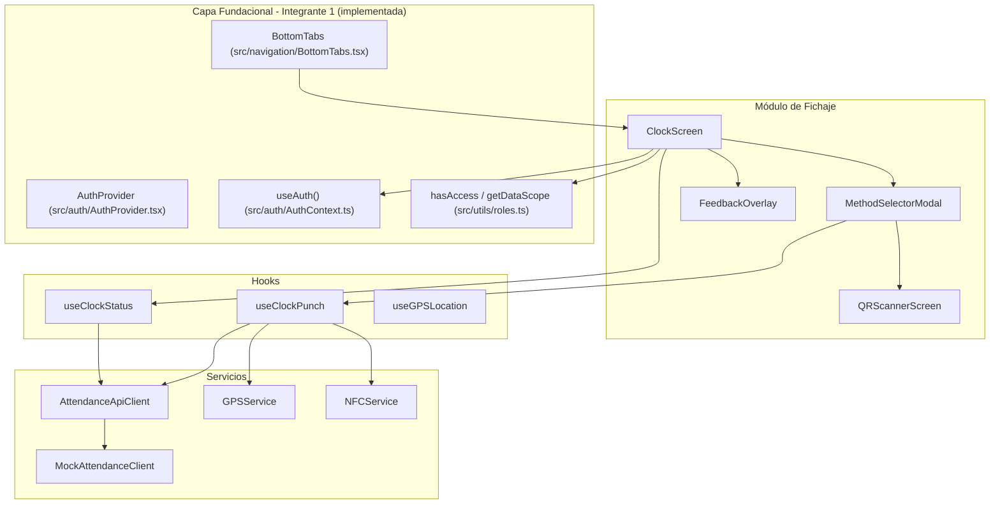
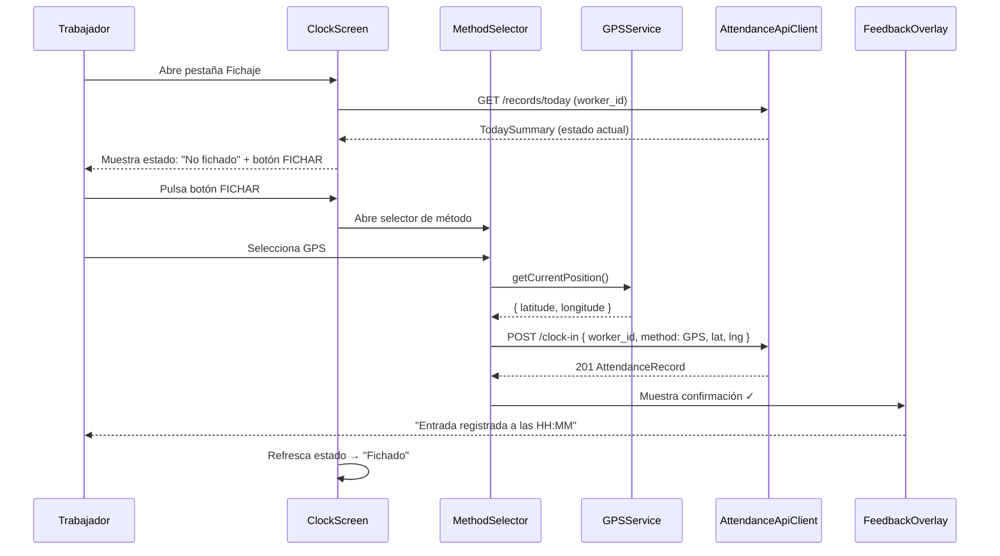
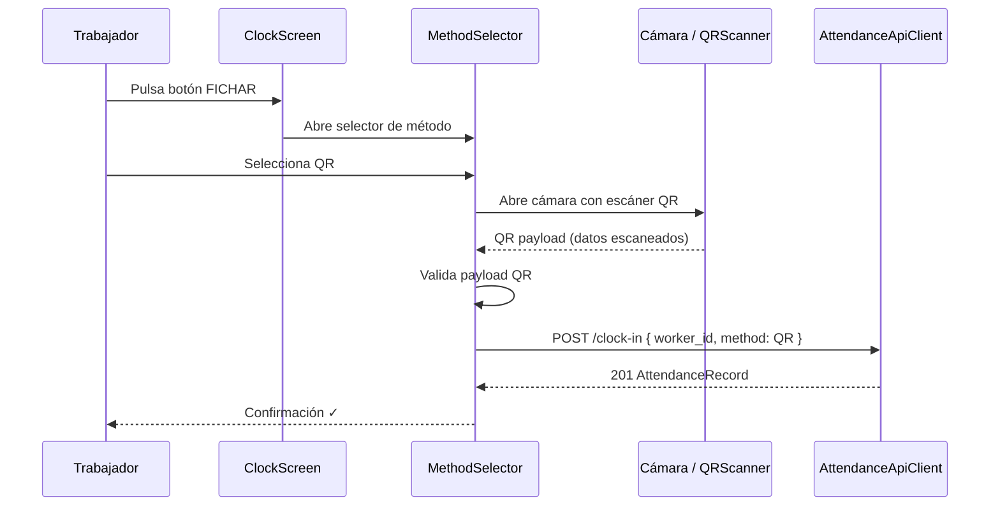
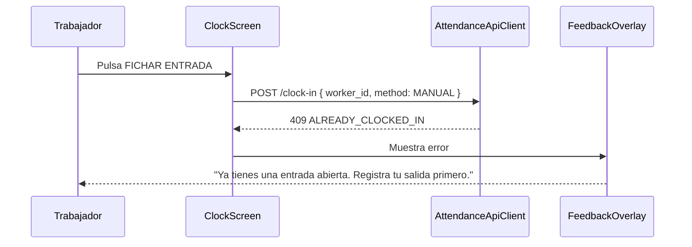

# Documento de Diseño: Pantalla de Fichaje (Clock-In / Clock-Out)

## Visión General

Este documento describe el diseño técnico de las pantallas de fichaje (clock-in / clock-out) para la aplicación móvil React Native. El módulo reemplaza el `ClockScreen` placeholder definido por el Integrante 1 y permite a los trabajadores registrar su entrada y salida mediante cuatro métodos: GPS, QR, NFC y MANUAL.

El diseño se integra sobre la capa fundacional implementada por el Integrante 1 (ya mergeada en `develop`), que incluye:

- **Tipos**: `UserRole`, `User`, `AuthService` en `src/types/index.ts`
- **Auth**: `AuthProvider` (recibe `authService` como prop), `useAuth()` hook en `src/auth/AuthContext.ts`, `MockAuthService` en `src/auth/MockAuthService.ts`
- **Navegación**: `MainStack` con renderizado condicional auth/app, `BottomTabs` con filtrado de pestañas por rol usando `TAB_VISIBILITY` y `hasAccess()`
- **Utilidades de rol**: `hasAccess()`, `getDataScope()`, `roleConfig`, `TAB_VISIBILITY` en `src/utils/roles.ts`
- **ClockScreen placeholder**: `src/screens/ClockScreen.tsx` — será reemplazado por la implementación real

El flujo principal consiste en: (1) mostrar el estado actual del trabajador (fichado o no fichado), (2) permitir seleccionar un método de fichaje, (3) ejecutar la captura de datos según el método elegido (ubicación GPS, escaneo QR, lectura NFC, o pulsación manual), (4) enviar la petición al API de asistencia, y (5) mostrar feedback visual del resultado.

Se utiliza un cliente API mock durante desarrollo que devuelve respuestas realistas basadas en `mock-data.json`, preparado para ser sustituido por llamadas HTTP reales al servicio de asistencia (Team 1).

## Arquitectura



## Integración con Código Existente (Integrante 1)

El módulo de fichaje se integra con el código ya implementado y mergeado en `develop`. A continuación se detallan los imports y dependencias exactas:

### Imports desde la capa fundacional

```typescript
// Desde src/auth/AuthContext.ts — hook de autenticación
import { useAuth } from '../auth/AuthContext';
// Retorna: { user, isAuthenticated, isLoading, login, logout, availableUsers }

// Desde src/types/index.ts — tipos compartidos
import type { User, UserRole } from '../types';

// Desde src/utils/roles.ts — utilidades de rol
import { hasAccess, getDataScope, TAB_VISIBILITY, roleConfig } from '../utils/roles';
import type { DataScope } from '../utils/roles';
```

### Punto de integración: BottomTabs

El `BottomTabs` actual (`src/navigation/BottomTabs.tsx`) importa `ClockScreen` directamente:

```typescript
// En BottomTabs.tsx (código existente del Integrante 1)
import { ClockScreen } from '../screens/ClockScreen';
// TAB_CONFIG incluye: { name: 'Clock', label: 'Fichaje', icon: '⏰', component: ClockScreen }
```

Al reemplazar el placeholder `ClockScreen`, el export debe mantener el mismo nombre y ubicación (`src/screens/ClockScreen.tsx`) para que `BottomTabs` funcione sin cambios.

### Estructura de archivos del Integrante 1 (ya implementada)

```
src/
├── App.tsx                        # Entry point: AuthProvider + NavigationContainer
├── types/index.ts                 # UserRole, User, AuthService
├── auth/
│   ├── AuthContext.ts             # React Context + useAuth() hook
│   ├── AuthProvider.tsx           # Provider (recibe authService como prop)
│   └── MockAuthService.ts        # Implementación mock + getAvailableUsers()
├── config/cognito.ts              # Configuración placeholder Cognito
├── navigation/
│   ├── BottomTabs.tsx             # Tabs con filtrado por rol (importa ClockScreen)
│   ├── MainStack.tsx              # Stack condicional auth/app
│   └── linking.ts                 # Deep links construction://
├── screens/
│   ├── ClockScreen.tsx            # ← PLACEHOLDER A REEMPLAZAR (Integrante 3)
│   ├── DashboardScreen.tsx        # Placeholder Integrante 2
│   ├── LoginScreen.tsx            # Login con selector de rol
│   ├── RecordsScreen.tsx          # Placeholder Integrante 4
│   └── IncidentsScreen.tsx        # Placeholder Integrante 5
└── utils/roles.ts                 # hasAccess, getDataScope, TAB_VISIBILITY, roleConfig
```

## Diagramas de Secuencia

### Flujo Principal: Fichaje con GPS



### Flujo: Fichaje con QR



### Flujo: Error — Ya fichado (409)



## Componentes e Interfaces

### Componente 1: ClockScreen

**Propósito**: Pantalla principal de fichaje. Muestra el estado actual del trabajador y el botón de acción principal.

**Responsabilidades**:
- Consultar el estado de fichaje actual al montar (GET /records/today)
- Mostrar indicador visual de estado: "Fichado" (con hora de entrada) o "No fichado"
- Mostrar botón de acción contextual: "Fichar Entrada" o "Fichar Salida"
- Abrir el selector de método al pulsar el botón
- Refrescar estado tras fichaje exitoso
- Mostrar feedback de resultado (éxito/error)

### Componente 2: MethodSelectorModal

**Propósito**: Modal que permite al usuario elegir el método de fichaje.

**Responsabilidades**:
- Mostrar los 4 métodos disponibles: GPS, QR, NFC, MANUAL
- Ejecutar el flujo específico del método seleccionado
- Delegar la llamada API al hook `useClockPunch`
- Cerrar el modal tras completar o cancelar

### Componente 3: QRScannerScreen

**Propósito**: Pantalla de cámara para escaneo de código QR.

**Responsabilidades**:
- Solicitar permisos de cámara
- Mostrar visor de cámara con overlay de escaneo
- Detectar y decodificar código QR
- Devolver el payload escaneado al componente padre
- Manejar errores de cámara y permisos

### Componente 4: FeedbackOverlay

**Propósito**: Overlay visual que muestra el resultado de la operación de fichaje.

**Responsabilidades**:
- Mostrar animación de éxito (✓) con mensaje y hora
- Mostrar animación de error (✗) con mensaje descriptivo
- Auto-cerrar tras un timeout configurable
- Permitir cierre manual por el usuario

## Modelos de Datos

### Tipos del Módulo de Fichaje

```typescript
// Métodos de fichaje disponibles
export type ClockMethod = 'QR' | 'NFC' | 'MANUAL' | 'GPS';

// Estado del fichaje del trabajador
export type ClockStatus = 'CLOCKED_IN' | 'CLOCKED_OUT' | 'LOADING' | 'ERROR';

// Ubicación geográfica
export interface GeoLocation {
  latitude: number;
  longitude: number;
}

// Registro de asistencia (del API)
export interface AttendanceRecord {
  id: string;
  worker_id: string;
  worker_name: string;
  date: string;
  clock_in: string;
  clock_out: string | null;
  clock_in_method: ClockMethod;
  clock_out_method: ClockMethod | null;
  clock_in_location: GeoLocation | null;
  clock_out_location: GeoLocation | null;
  total_hours: number | null;
  status: 'OPEN' | 'CLOSED' | 'INCIDENT';
  modified_by: string | null;
  modification_reason: string | null;
  created_at: string;
}

// Resumen del día (del API)
export interface TodaySummary {
  date: string;
  total_workers_present: number;
  total_workers_absent: number;
  records: AttendanceRecord[];
}

// Request de fichaje
export interface ClockRequest {
  worker_id: string;
  method: ClockMethod;
  latitude?: number;
  longitude?: number;
  notes?: string;
}

// Resultado de operación de fichaje
export interface ClockResult {
  success: boolean;
  record?: AttendanceRecord;
  error?: ClockError;
}

// Error de fichaje
export interface ClockError {
  code: string;
  message: string;
}

// Estado del hook useClockStatus
export interface ClockStatusState {
  status: ClockStatus;
  currentRecord: AttendanceRecord | null;
  todaySummary: TodaySummary | null;
  refresh: () => Promise<void>;
}

// Estado del hook useClockPunch
export interface ClockPunchState {
  isPunching: boolean;
  punch: (method: ClockMethod) => Promise<ClockResult>;
}
```

**Reglas de Validación**:
- `worker_id` debe ser un UUID válido
- `method` debe ser uno de: QR, NFC, MANUAL, GPS
- `latitude` y `longitude` son requeridos cuando `method === 'GPS'`
- `latitude` debe estar entre -90 y 90
- `longitude` debe estar entre -180 y 180


### Interfaz del Cliente API de Asistencia

```typescript
export interface AttendanceApiClient {
  clockIn(request: ClockRequest): Promise<AttendanceRecord>;
  clockOut(request: ClockRequest): Promise<AttendanceRecord>;
  getTodayRecords(workerId: string): Promise<TodaySummary>;
}
```

### Interfaz de Servicios de Hardware

```typescript
export interface GPSService {
  getCurrentPosition(): Promise<GeoLocation>;
  isAvailable(): Promise<boolean>;
}

export interface NFCService {
  readTag(): Promise<string>;
  isAvailable(): Promise<boolean>;
  cancelRead(): void;
}

export interface QRScannerResult {
  data: string;
  type: string;
}
```

## Pseudocódigo Algorítmico

### Algoritmo Principal: Ejecutar Fichaje

```typescript
async function executePunch(
  user: User,
  action: 'clock-in' | 'clock-out',
  method: ClockMethod,
  apiClient: AttendanceApiClient,
  gpsService: GPSService,
  nfcService: NFCService
): Promise<ClockResult> {
  // PRECONDICIÓN: user no es null, user.id es UUID válido
  // PRECONDICIÓN: action es 'clock-in' o 'clock-out'
  // PRECONDICIÓN: method es uno de QR, NFC, MANUAL, GPS
  // POSTCONDICIÓN: retorna ClockResult con success=true y record, o success=false y error

  try {
    // Paso 1: Construir request base
    const request: ClockRequest = {
      worker_id: user.id,
      method: method,
    };

    // Paso 2: Capturar datos adicionales según método
    if (method === 'GPS') {
      const location = await gpsService.getCurrentPosition();
      // INVARIANTE: location.latitude ∈ [-90, 90] ∧ location.longitude ∈ [-180, 180]
      request.latitude = location.latitude;
      request.longitude = location.longitude;
    }
    // NFC y QR: los datos se capturan antes de llamar a executePunch
    // MANUAL: no requiere datos adicionales

    // Paso 3: Enviar request al API
    let record: AttendanceRecord;
    if (action === 'clock-in') {
      record = await apiClient.clockIn(request);
    } else {
      record = await apiClient.clockOut(request);
    }

    // POSTCONDICIÓN: record.worker_id === user.id
    // POSTCONDICIÓN: record.status === 'OPEN' si clock-in, 'CLOSED' si clock-out
    return { success: true, record };

  } catch (error: any) {
    return {
      success: false,
      error: {
        code: error.code ?? 'UNKNOWN_ERROR',
        message: error.message ?? 'Error desconocido al fichar',
      },
    };
  }
}
```

### Algoritmo: Determinar Estado de Fichaje

```typescript
function determineClockStatus(
  todaySummary: TodaySummary | null,
  workerId: string
): { status: ClockStatus; currentRecord: AttendanceRecord | null } {
  // PRECONDICIÓN: workerId es UUID válido
  // POSTCONDICIÓN: si hay registro OPEN → status='CLOCKED_IN', currentRecord=registro
  // POSTCONDICIÓN: si no hay registro OPEN → status='CLOCKED_OUT', currentRecord=null

  if (!todaySummary) {
    return { status: 'CLOCKED_OUT', currentRecord: null };
  }

  // Buscar registro abierto del trabajador
  const openRecord = todaySummary.records.find(
    (r) => r.worker_id === workerId && r.status === 'OPEN'
  );

  if (openRecord) {
    return { status: 'CLOCKED_IN', currentRecord: openRecord };
  }

  return { status: 'CLOCKED_OUT', currentRecord: null };
}
```

### Algoritmo: Validar Payload QR

```typescript
function validateQRPayload(
  payload: string,
  currentUserId: string
): { valid: boolean; errorMessage?: string } {
  // PRECONDICIÓN: payload es string no vacío
  // PRECONDICIÓN: currentUserId es UUID válido
  // POSTCONDICIÓN: valid=true si el payload es un formato reconocido
  // POSTCONDICIÓN: valid=false con errorMessage si el payload es inválido

  if (!payload || payload.trim().length === 0) {
    return { valid: false, errorMessage: 'Código QR vacío' };
  }

  // Intentar parsear como UUID (formato esperado del QR de obra)
  const uuidRegex = /^[0-9a-f]{8}-[0-9a-f]{4}-[0-9a-f]{4}-[0-9a-f]{4}-[0-9a-f]{12}$/i;
  if (!uuidRegex.test(payload)) {
    return { valid: false, errorMessage: 'Código QR no válido' };
  }

  return { valid: true };
}
```

## Funciones Clave con Especificaciones Formales

### Hook: useClockStatus

```typescript
function useClockStatus(userId: string): ClockStatusState
```

**Precondiciones:**
- `userId` es un UUID válido no vacío
- El componente está dentro de un `AuthProvider`

**Postcondiciones:**
- Al montar, realiza GET /records/today y determina el estado
- `status` refleja el estado real del trabajador: CLOCKED_IN o CLOCKED_OUT
- `currentRecord` contiene el registro OPEN si existe, null si no
- `refresh()` recarga el estado desde el API

**Invariantes de Loop:** N/A

### Hook: useClockPunch

```typescript
function useClockPunch(
  userId: string,
  currentStatus: ClockStatus,
  onSuccess: () => void
): ClockPunchState
```

**Precondiciones:**
- `userId` es un UUID válido
- `currentStatus` es CLOCKED_IN o CLOCKED_OUT (no LOADING ni ERROR)

**Postcondiciones:**
- `punch(method)` ejecuta clock-in si `currentStatus === 'CLOCKED_OUT'`, clock-out si `currentStatus === 'CLOCKED_IN'`
- `isPunching` es true durante la ejecución de la petición
- Al completar con éxito, invoca `onSuccess` para refrescar el estado
- Retorna `ClockResult` con el resultado de la operación

**Invariantes:**
- `isPunching` es true si y solo si hay una petición en curso
- No se puede ejecutar `punch()` mientras `isPunching === true`

### Hook: useGPSLocation

```typescript
function useGPSLocation(): {
  getLocation: () => Promise<GeoLocation>;
  isAvailable: boolean;
}
```

**Precondiciones:**
- El dispositivo tiene hardware GPS

**Postcondiciones:**
- `getLocation()` solicita permisos si no están concedidos
- Retorna `GeoLocation` con coordenadas válidas
- Lanza error si los permisos son denegados o hay timeout
- `isAvailable` indica si el GPS está disponible en el dispositivo

## Ejemplo de Uso

```typescript
// ClockScreen.tsx — Reemplazo del placeholder del Integrante 1
// IMPORTANTE: Mantener el export con el mismo nombre para compatibilidad con BottomTabs.tsx
import React, { useState } from 'react';
import { View, Text, TouchableOpacity } from 'react-native';
import { useAuth } from '../auth/AuthContext';  // ← Import real del Integrante 1
import { useClockStatus } from '../hooks/useClockStatus';
import { useClockPunch } from '../hooks/useClockPunch';
import { MethodSelectorModal } from '../components/MethodSelectorModal';
import { FeedbackOverlay } from '../components/FeedbackOverlay';
import type { ClockMethod, ClockResult } from '../types/clock';

export function ClockScreen() {
  const { user } = useAuth();
  const { status, currentRecord, refresh } = useClockStatus(user!.id);
  const { isPunching, punch } = useClockPunch(user!.id, status, refresh);
  const [showMethodSelector, setShowMethodSelector] = useState(false);
  const [feedback, setFeedback] = useState<ClockResult | null>(null);

  const handleMethodSelected = async (method: ClockMethod) => {
    setShowMethodSelector(false);
    const result = await punch(method);
    setFeedback(result);
  };

  const actionLabel = status === 'CLOCKED_IN' ? 'Fichar Salida' : 'Fichar Entrada';

  return (
    <View>
      {/* Indicador de estado */}
      <StatusIndicator status={status} record={currentRecord} />

      {/* Botón principal */}
      <TouchableOpacity
        onPress={() => setShowMethodSelector(true)}
        disabled={isPunching || status === 'LOADING'}
        accessibilityLabel={actionLabel}
        accessibilityRole="button"
      >
        <Text>{actionLabel}</Text>
      </TouchableOpacity>

      {/* Selector de método */}
      <MethodSelectorModal
        visible={showMethodSelector}
        onSelect={handleMethodSelected}
        onClose={() => setShowMethodSelector(false)}
      />

      {/* Feedback */}
      {feedback && (
        <FeedbackOverlay
          result={feedback}
          onDismiss={() => setFeedback(null)}
        />
      )}
    </View>
  );
}
```

```typescript
// Ejemplo: Mock API Client para desarrollo
// Usa los IDs de mock-data.json para consistencia con el MockAuthService del Integrante 1
import type { AttendanceApiClient, ClockRequest, AttendanceRecord, TodaySummary } from '../types/clock';

// IDs de workers de mock-data.json para respuestas realistas
const MOCK_WORKER_NAMES: Record<string, string> = {
  'a1b2c3d4-0001-0001-0001-000000000001': 'Carlos Martínez',
  'a1b2c3d4-0001-0001-0001-000000000002': 'Ana García',
  'a1b2c3d4-0001-0001-0001-000000000003': 'Miguel López',
  'a1b2c3d4-0001-0001-0001-000000000004': 'Pedro Fernández',
};

export class MockAttendanceClient implements AttendanceApiClient {
  private openRecords: Map<string, AttendanceRecord> = new Map();

  async clockIn(request: ClockRequest): Promise<AttendanceRecord> {
    if (this.openRecords.has(request.worker_id)) {
      throw { code: 'ALREADY_CLOCKED_IN', message: 'Ya existe una entrada abierta sin salida' };
    }

    const record: AttendanceRecord = {
      id: generateUUID(),
      worker_id: request.worker_id,
      worker_name: MOCK_WORKER_NAMES[request.worker_id] ?? 'Trabajador Mock',
      date: new Date().toISOString().split('T')[0],
      clock_in: new Date().toISOString(),
      clock_out: null,
      clock_in_method: request.method,
      clock_out_method: null,
      clock_in_location: request.latitude
        ? { latitude: request.latitude, longitude: request.longitude! }
        : null,
      clock_out_location: null,
      total_hours: null,
      status: 'OPEN',
      modified_by: null,
      modification_reason: null,
      created_at: new Date().toISOString(),
    };

    this.openRecords.set(request.worker_id, record);
    return record;
  }

  async clockOut(request: ClockRequest): Promise<AttendanceRecord> {
    const openRecord = this.openRecords.get(request.worker_id);
    if (!openRecord) {
      throw { code: 'NO_OPEN_RECORD', message: 'No hay entrada abierta para este trabajador' };
    }

    const closedRecord: AttendanceRecord = {
      ...openRecord,
      clock_out: new Date().toISOString(),
      clock_out_method: request.method,
      clock_out_location: request.latitude
        ? { latitude: request.latitude, longitude: request.longitude! }
        : null,
      status: 'CLOSED',
      total_hours: calculateHours(openRecord.clock_in, new Date().toISOString()),
    };

    this.openRecords.delete(request.worker_id);
    return closedRecord;
  }

  async getTodayRecords(workerId: string): Promise<TodaySummary> {
    const records = this.openRecords.has(workerId)
      ? [this.openRecords.get(workerId)!]
      : [];
    return {
      date: new Date().toISOString().split('T')[0],
      total_workers_present: records.length,
      total_workers_absent: 0,
      records,
    };
  }
}
```

## Propiedades de Corrección

*Una propiedad es una característica o comportamiento que debe cumplirse en todas las ejecuciones válidas de un sistema — esencialmente, una declaración formal sobre lo que el sistema debe hacer. Las propiedades sirven como puente entre especificaciones legibles por humanos y garantías de corrección verificables por máquina.*

### Propiedad 1: Consistencia entre estado visual y registro abierto

*Para cualquier* trabajador y *cualquier* respuesta de TodaySummary, el estado mostrado en pantalla debe ser `CLOCKED_IN` si y solo si existe un registro con `status === 'OPEN'` y `worker_id === user.id` en los registros del día. En caso contrario, el estado debe ser `CLOCKED_OUT`.

**Valida: Requisitos 1.2, 1.3**

### Propiedad 2: Acción contextual correcta según estado

*Para cualquier* estado de fichaje, si el trabajador está `CLOCKED_OUT` el botón debe mostrar "Fichar Entrada" y ejecutar `clock-in`, y si está `CLOCKED_IN` el botón debe mostrar "Fichar Salida" y ejecutar `clock-out`. Nunca debe ser posible ejecutar `clock-in` estando fichado ni `clock-out` sin estar fichado.

**Valida: Requisitos 1.4, 1.5**

### Propiedad 3: Validación de ClockRequest según método

*Para cualquier* ClockRequest construido por el sistema, el worker_id debe ser un UUID válido, el method debe ser uno de QR, NFC, MANUAL o GPS, y las coordenadas (latitude ∈ [-90, 90], longitude ∈ [-180, 180]) deben estar presentes si y solo si el method es GPS. Para métodos QR, NFC y MANUAL, latitude y longitude deben ser undefined.

**Valida: Requisitos 4.3, 11.1, 11.2, 11.3, 11.4**

### Propiedad 4: Idempotencia de clock-in — error 409

*Para cualquier* trabajador que ya tiene un registro OPEN, intentar clock-in debe resultar en un error con código `ALREADY_CLOCKED_IN` (409) y el estado del trabajador no debe cambiar. El registro abierto existente debe permanecer intacto.

**Valida: Requisitos 8.4, 9.1**

### Propiedad 5: Método de fichaje se preserva en el registro

*Para cualquier* método de fichaje seleccionado (QR, NFC, MANUAL, GPS), el `AttendanceRecord` retornado por el API debe tener `clock_in_method` (en clock-in) o `clock_out_method` (en clock-out) igual al método enviado en el ClockRequest.

**Valida: Requisitos 12.1, 12.2**

### Propiedad 6: Feedback visual corresponde al resultado

*Para cualquier* resultado de operación de fichaje, si `ClockResult.success === true` se debe mostrar feedback de confirmación, y si `ClockResult.success === false` se debe mostrar feedback de error con el mensaje de `ClockResult.error.message`. No debe existir un estado donde el resultado sea exitoso pero se muestre error, ni viceversa.

**Valida: Requisitos 7.1, 7.2**

### Propiedad 7: QR payload debe ser UUID válido

*Para cualquier* string escaneado como código QR, `validateQRPayload` debe retornar `valid === true` si y solo si el payload es un UUID válido (formato `xxxxxxxx-xxxx-xxxx-xxxx-xxxxxxxxxxxx`). Cualquier otro formato debe retornar `valid === false` con un mensaje de error descriptivo.

**Valida: Requisitos 3.3, 3.5**

### Propiedad 8: No se puede ejecutar punch durante operación en curso

*Para cualquier* estado donde `isPunching === true`, invocar `punch()` no debe iniciar una nueva petición al API. Esto previene fichajes duplicados por doble pulsación.

**Valida: Requisito 10.1**

### Propiedad 9: El worker_id del request siempre coincide con el usuario autenticado

*Para cualquier* operación de fichaje y *cualquier* usuario autenticado, el `worker_id` enviado en el `ClockRequest` debe ser idéntico al `user.id` del usuario autenticado obtenido de `useAuth()`. Nunca debe ser posible fichar en nombre de otro trabajador desde esta pantalla.

**Valida: Requisitos 10.2, 10.3**

### Propiedad 10: Round-trip de clock-in / clock-out

*Para cualquier* trabajador sin registro abierto, ejecutar clock-in seguido de clock-out debe producir un AttendanceRecord con status CLOSED, clock_out no nulo y total_hours calculado. Además, tras el clock-out, el estado del trabajador debe volver a CLOCKED_OUT y no debe quedar ningún registro OPEN.

**Valida: Requisitos 7.5, 8.2, 8.3, 8.5**

## Manejo de Errores

### Errores de API

| Escenario | Código HTTP | Comportamiento |
|-----------|-------------|----------------|
| Clock-in con registro abierto | 409 | Muestra error: "Ya tienes una entrada abierta. Registra tu salida primero." Refresca estado. |
| Clock-out sin registro abierto | 404 | Muestra error: "No hay entrada abierta para registrar salida." Refresca estado. |
| Request inválido | 400 | Muestra error genérico: "Datos de fichaje inválidos." |
| Sin conexión | — | Muestra error: "Sin conexión. Verifica tu conexión a internet." |
| Timeout | — | Muestra error: "La operación tardó demasiado. Inténtalo de nuevo." |

### Errores de Hardware

| Escenario | Comportamiento |
|-----------|----------------|
| GPS: permisos denegados | Muestra alerta solicitando activar permisos en ajustes. Deshabilita opción GPS. |
| GPS: timeout (>10s) | Muestra error: "No se pudo obtener la ubicación. Inténtalo de nuevo o usa otro método." |
| GPS: servicio desactivado | Muestra alerta solicitando activar ubicación. Deshabilita opción GPS. |
| QR: permisos de cámara denegados | Muestra alerta solicitando activar permisos. Deshabilita opción QR. |
| QR: código no reconocido | Muestra error: "Código QR no válido. Escanea el código de la obra." |
| NFC: no disponible en dispositivo | Oculta opción NFC del selector de métodos. |
| NFC: lectura fallida | Muestra error: "No se pudo leer la etiqueta NFC. Acerca el dispositivo de nuevo." |
| NFC: timeout | Muestra error: "Tiempo de lectura NFC agotado. Inténtalo de nuevo." |

### Principios de Manejo de Errores

1. **Feedback inmediato**: Todo error muestra un mensaje descriptivo en español al usuario.
2. **Degradación elegante**: Si un método de hardware no está disponible, se oculta o deshabilita sin afectar los demás métodos.
3. **Refresco automático**: Tras errores 409/404, se refresca el estado para sincronizar la UI con el servidor.
4. **Sin estados inconsistentes**: Cualquier error durante el fichaje deja la pantalla en un estado válido (CLOCKED_IN o CLOCKED_OUT).

## Estrategia de Testing

### Framework y Herramientas

| Herramienta | Propósito |
|-------------|-----------|
| Jest | Framework de testing principal |
| React Native Testing Library | Testing de componentes |
| fast-check | Property-based testing |

### Tests Unitarios

1. **determineClockStatus**: Verifica que retorna CLOCKED_IN con registro OPEN, CLOCKED_OUT sin registro OPEN, y maneja TodaySummary null.
2. **validateQRPayload**: Verifica UUIDs válidos, strings vacíos, formatos inválidos.
3. **MockAttendanceClient**: Verifica clock-in crea registro OPEN, clock-out cierra registro, clock-in duplicado lanza 409, clock-out sin registro lanza 404.
4. **ClockScreen render**: Verifica que muestra "Fichar Entrada" cuando CLOCKED_OUT, "Fichar Salida" cuando CLOCKED_IN.
5. **MethodSelectorModal**: Verifica que muestra los 4 métodos, oculta NFC si no disponible.
6. **FeedbackOverlay**: Verifica que muestra confirmación en éxito, error en fallo.

### Tests de Propiedades (Property-Based Testing)

Se usa `fast-check`. Cada test ejecuta mínimo 100 iteraciones.

| Propiedad | Generadores | Verificación |
|-----------|-------------|-------------|
| P1: Consistencia estado-registro | Generar TodaySummary con registros aleatorios (OPEN/CLOSED) | `determineClockStatus` retorna CLOCKED_IN ↔ existe registro OPEN del worker |
| P2: Acción contextual | Generar ClockStatus aleatorio | clock-in si CLOCKED_OUT, clock-out si CLOCKED_IN |
| P3: GPS coordenadas válidas | Generar lat ∈ [-90,90], lng ∈ [-180,180] | Request contiene coordenadas dentro de rango |
| P4: Idempotencia 409 | Generar worker_id, ejecutar clock-in dos veces | Segunda llamada lanza ALREADY_CLOCKED_IN |
| P5: Método preservado | Generar ClockMethod aleatorio | record.clock_in_method === method enviado |
| P6: Feedback corresponde a resultado | Generar ClockResult aleatorio (success/error) | Feedback tipo corresponde a success |
| P7: QR UUID válido | Generar strings aleatorios + UUIDs válidos | validateQRPayload(uuid) → valid, validateQRPayload(random) → invalid |
| P9: worker_id coincide con user | Generar user aleatorio del mock | request.worker_id === user.id |

### Configuración de Generadores fast-check

```typescript
import fc from 'fast-check';

const clockMethodArb = fc.constantFrom('QR', 'NFC', 'MANUAL', 'GPS' as const);

const geoLocationArb = fc.record({
  latitude: fc.double({ min: -90, max: 90, noNaN: true }),
  longitude: fc.double({ min: -180, max: 180, noNaN: true }),
});

const clockStatusArb = fc.constantFrom('CLOCKED_IN', 'CLOCKED_OUT' as const);

const uuidArb = fc.uuid();

// IDs reales de mock-data.json (consistentes con MockAuthService del Integrante 1)
const mockUserIdArb = fc.constantFrom(
  'a1b2c3d4-0001-0001-0001-000000000001',  // Carlos Martínez (ADMIN)
  'a1b2c3d4-0001-0001-0001-000000000002',  // Ana García (JEFE_OBRA)
  'a1b2c3d4-0001-0001-0001-000000000003',  // Miguel López (ENCARGADO)
  'a1b2c3d4-0001-0001-0001-000000000004',  // Pedro Fernández (TRABAJADOR)
);

const attendanceRecordArb = fc.record({
  id: fc.uuid(),
  worker_id: fc.uuid(),
  worker_name: fc.string({ minLength: 1 }),
  date: fc.date().map(d => d.toISOString().split('T')[0]),
  clock_in: fc.date().map(d => d.toISOString()),
  clock_out: fc.option(fc.date().map(d => d.toISOString()), { nil: null }),
  clock_in_method: clockMethodArb,
  clock_out_method: fc.option(clockMethodArb, { nil: null }),
  clock_in_location: fc.option(geoLocationArb, { nil: null }),
  clock_out_location: fc.option(geoLocationArb, { nil: null }),
  total_hours: fc.option(fc.double({ min: 0, max: 24, noNaN: true }), { nil: null }),
  status: fc.constantFrom('OPEN', 'CLOSED', 'INCIDENT' as const),
  modified_by: fc.option(fc.uuid(), { nil: null }),
  modification_reason: fc.option(fc.string(), { nil: null }),
  created_at: fc.date().map(d => d.toISOString()),
});
```

## Consideraciones de Rendimiento

- **Debounce en botón de fichaje**: Prevenir doble pulsación con `isPunching` flag y deshabilitación del botón.
- **Timeout GPS**: Máximo 10 segundos con `enableHighAccuracy: true`. Si falla, ofrecer método alternativo.
- **Caché de estado**: El estado de fichaje se consulta al montar y tras cada operación. No se usa polling continuo.
- **QR Scanner**: Usar `react-native-vision-camera` con frame processor para escaneo eficiente sin bloquear el hilo principal.

## Consideraciones de Seguridad

- **worker_id siempre del contexto auth**: El `worker_id` se obtiene de `useAuth().user.id`, nunca de input del usuario.
- **Validación de QR payload**: El payload QR se valida como UUID antes de usarse. No se ejecuta código arbitrario del QR.
- **Permisos de hardware**: Se solicitan permisos de cámara, ubicación y NFC de forma explícita con explicación al usuario.
- **Sin almacenamiento local de registros**: Los registros de asistencia no se persisten localmente; siempre se consultan del API.

## Dependencias

### Dependencias Existentes (Integrante 1 — código implementado en develop)

| Módulo | Import | Uso |
|--------|--------|-----|
| `useAuth()` | `import { useAuth } from '../auth/AuthContext'` | Obtener `user`, `isAuthenticated` |
| `hasAccess()` | `import { hasAccess } from '../utils/roles'` | Verificar acceso por rol |
| `getDataScope()` | `import { getDataScope } from '../utils/roles'` | Determinar alcance de datos (own/team/all) |
| `TAB_VISIBILITY` | `import { TAB_VISIBILITY } from '../utils/roles'` | Configuración de visibilidad de pestañas |
| `roleConfig` | `import { roleConfig } from '../utils/roles'` | Config centralizada: dataScope + visibleTabs por rol |
| `User`, `UserRole` | `import type { User, UserRole } from '../types'` | Tipos compartidos |
| `AuthService` | `import type { AuthService } from '../types'` | Interfaz de servicio de auth |
| `BottomTabs` | `src/navigation/BottomTabs.tsx` | Importa `ClockScreen` directamente — no modificar |
| `MockAuthService` | `src/auth/MockAuthService.ts` | Clase + `getAvailableUsers()` función exportada |

### Archivos Nuevos del Integrante 3

```
src/
├── types/
│   └── clock.ts                   # ClockMethod, ClockStatus, AttendanceRecord, ClockRequest, etc.
├── hooks/
│   ├── useClockStatus.ts          # Hook: estado de fichaje actual
│   ├── useClockPunch.ts           # Hook: ejecutar fichaje
│   └── useGPSLocation.ts         # Hook: captura GPS
├── components/
│   ├── MethodSelectorModal.tsx    # Modal selector de método
│   ├── FeedbackOverlay.tsx        # Overlay de confirmación/error
│   ├── StatusIndicator.tsx        # Indicador visual de estado
│   └── QRScannerScreen.tsx        # Pantalla de escaneo QR
├── services/
│   ├── AttendanceApiClient.ts     # Interfaz + factory del cliente API
│   ├── MockAttendanceClient.ts    # Implementación mock
│   ├── GPSService.ts              # Servicio de geolocalización
│   └── NFCService.ts              # Servicio de lectura NFC
└── screens/
    └── ClockScreen.tsx            # ← REEMPLAZA el placeholder existente
```

### Dependencias Nuevas (React Native)

| Librería | Propósito |
|----------|-----------|
| `@react-native-community/geolocation` | Captura de ubicación GPS |
| `react-native-vision-camera` | Cámara para escaneo QR |
| `vision-camera-code-scanner` | Plugin de escaneo de códigos para vision-camera |
| `react-native-nfc-manager` | Lectura de tags NFC |

### Dependencias del API (attendance-service)

| Endpoint | Método | Uso |
|----------|--------|-----|
| `/clock-in` | POST | Registrar entrada |
| `/clock-out` | POST | Registrar salida |
| `/records/today` | GET | Consultar estado actual |
