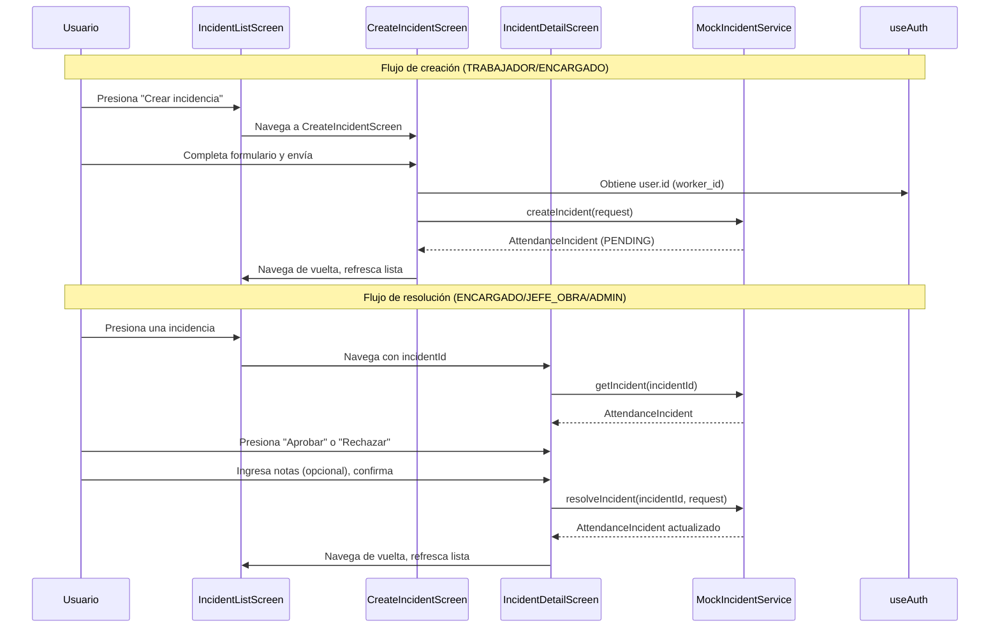

# Diseño — Pantallas de Incidencias y Componentes UI Compartidos

## Visión General

Este documento describe el diseño técnico de las pantallas de gestión de incidencias de fichaje y los componentes UI compartidos de la aplicación móvil React Native. Este módulo cubre:

- Tipos TypeScript alineados con el contrato de `attendance-service.yaml` (incidencias)
- Sistema de tema centralizado (colores, espaciado, tipografía, borderRadius)
- 5 componentes UI compartidos: StatusBadge, Card, LoadingState, EmptyState, ErrorState
- Servicio mock de incidencias con filtrado por rol
- 4 pantallas de incidencias: listado con filtros, creación, detalle y resolución
- Navegación interna con stack navigator dentro de la pestaña Incidencias
- Utilidades de formateo para fechas y etiquetas de tipo de incidencia

El módulo depende de la capa fundacional del Integrante 1: `AuthProvider`, `useAuth`, `hasAccess`, `getDataScope`, tipos `User` y `UserRole`, y la estructura de navegación con `BottomTabs`. Los datos se obtienen de un servicio mock local hasta que el backend real (Equipo 1) esté disponible.

**Decisión de diseño clave:** Se sigue el patrón de inversión de dependencias establecido por el Integrante 1. El `MockIncidentService` implementa una interfaz `IncidentService` que será sustituida por llamadas HTTP reales cuando el backend esté listo, sin modificar las pantallas.

## Arquitectura

### Diagrama de Componentes

```mermaid
graph TD
    subgraph Persona1["Capa Fundacional (Integrante 1)"]
        AP[AuthProvider / useAuth]
        BT[BottomTabs]
        Roles[hasAccess / getDataScope]
        Types1[User / UserRole]
    end

    subgraph Theme["Sistema de Tema"]
        Colors[colors.ts]
        Spacing[spacing.ts]
        Typography[typography.ts]
        BR[borderRadius]
        ThemeIndex[theme/index.ts]
    end

    subgraph SharedUI["Componentes UI Compartidos"]
        SB[StatusBadge]
        Card[Card]
        LS[LoadingState]
        ES[EmptyState]
        ErrS[ErrorState]
    end

    subgraph IncidentTypes["Tipos de Incidencias"]
        IT[incidents.ts]
    end

    subgraph MockService["Servicio Mock"]
        IS[IncidentService Interface]
        MIS[MockIncidentService]
        MockData[Datos mock iniciales]
    end

    subgraph Screens["Pantallas de Incidencias"]
        ISNav[IncidentsStackNavigator]
        IList[IncidentListScreen]
        ICreate[CreateIncidentScreen]
        IDetail[IncidentDetailScreen]
    end

    subgraph Utils["Utilidades"]
        Fmt[formatters.ts]
    end

    BT --> ISNav
    ISNav --> IList
    ISNav --> ICreate
    ISNav --> IDetail

    IList --> IS
    IList --> SB
    IList --> Card
    IList --> LS
    IList --> ES
    IList --> ErrS
    ICreate --> IS
    IDetail --> IS
    IDetail --> SB

    IS --> MIS
    MIS --> MockData
    MIS --> Roles

    SB --> ThemeIndex
    Card --> ThemeIndex
    LS --> ThemeIndex
    ES --> ThemeIndex
    ErrS --> ThemeIndex

    IList --> AP
    ICreate --> AP
    IDetail --> AP
    IList --> Fmt
    IDetail --> Fmt

    ThemeIndex --> Colors
    ThemeIndex --> Spacing
    ThemeIndex --> Typography
end
```

### Diagrama de Flujo: Crear y Resolver Incidencia



### Estructura de Archivos

```
src/
├── types/
│   ├── index.ts              # UserRole, User, AuthService (Integrante 1)
│   └── incidents.ts          # IncidentType, IncidentStatus, AttendanceIncident,
│                              # CreateIncidentRequest, ResolveIncidentRequest,
│                              # PaginatedResponse<T>, ApiError
├── theme/
│   ├── colors.ts             # Paleta de colores (primario, neutros, estados)
│   ├── spacing.ts            # Escala de espaciado (múltiplos de 4px)
│   ├── typography.ts         # Estilos de tipografía
│   └── index.ts              # Re-exporta todo como objeto Theme tipado
├── components/
│   ├── StatusBadge.tsx       # Badge de estado con color
│   ├── Card.tsx              # Contenedor presionable con sombra
│   ├── LoadingState.tsx      # Spinner centrado con mensaje
│   ├── EmptyState.tsx        # Icono + título + mensaje
│   └── ErrorState.tsx        # Mensaje de error + botón reintentar
├── services/
│   ├── IncidentService.ts    # Interfaz del servicio de incidencias
│   └── MockIncidentService.ts # Implementación mock con datos locales
├── utils/
│   ├── roles.ts              # hasAccess, getDataScope (Integrante 1)
│   └── formatters.ts         # formatDate, formatDateTime, getIncidentTypeLabel
├── screens/
│   └── incidents/
│       ├── IncidentListScreen.tsx
│       ├── CreateIncidentScreen.tsx
│       └── IncidentDetailScreen.tsx
├── navigation/
│   ├── BottomTabs.tsx         # (Integrante 1) — contiene pestaña Incidencias
│   └── IncidentsStackNavigator.tsx  # Stack interno del módulo
└── App.tsx
```

**Decisión de diseño:** Los tipos de incidencias se colocan en `src/types/incidents.ts` (archivo separado) en lugar de extender `src/types/index.ts` del Integrante 1, para evitar conflictos de merge y mantener la separación de responsabilidades entre integrantes. Se re-exportan desde `index.ts` si es necesario.

**Decisión de diseño:** El tema se organiza en `src/theme/` con archivos separados por responsabilidad (colors, spacing, typography) y un `index.ts` que los agrupa. Esto permite que otros integrantes importen `import { theme } from '../theme'` sin conocer la estructura interna.

**Decisión de diseño:** Las pantallas de incidencias se agrupan en `src/screens/incidents/` para distinguirlas de las pantallas placeholder del Integrante 1 que están en `src/screens/`.


## Componentes e Interfaces

### 1. Tipos de Incidencias (`src/types/incidents.ts`)

```typescript
// Tipos alineados con attendance-service.yaml — sección Incidents

export type IncidentType =
  | 'OLVIDO_ENTRADA'
  | 'OLVIDO_SALIDA'
  | 'CORRECCION_HORA'
  | 'FICHAJE_DUPLICADO'
  | 'OTRO';

export type IncidentStatus = 'PENDING' | 'RESOLVED' | 'REJECTED';

// Incluye también los estados de AttendanceRecord para StatusBadge
export type RecordStatus = 'OPEN' | 'CLOSED' | 'INCIDENT';
export type AllStatus = IncidentStatus | RecordStatus;

export interface AttendanceIncident {
  id: string;                          // UUID
  worker_id: string;                   // UUID
  worker_name: string;
  type: IncidentType;
  description: string;
  affected_date: string;               // formato: YYYY-MM-DD
  proposed_clock_in: string | null;    // formato: ISO 8601
  proposed_clock_out: string | null;   // formato: ISO 8601
  status: IncidentStatus;
  resolution_notes: string | null;
  resolved_by: string | null;          // UUID
  created_at: string;                  // formato: ISO 8601
  resolved_at: string | null;          // formato: ISO 8601
}

export interface CreateIncidentRequest {
  worker_id: string;                   // UUID — obligatorio
  type: IncidentType;                  // obligatorio
  description: string;                 // obligatorio
  affected_date: string;               // obligatorio — formato: YYYY-MM-DD
  proposed_clock_in?: string;          // opcional — formato: ISO 8601
  proposed_clock_out?: string;         // opcional — formato: ISO 8601
}

export type Resolution = 'APPROVE' | 'REJECT';

export interface ResolveIncidentRequest {
  resolution: Resolution;              // obligatorio
  notes?: string;                      // opcional
}

export interface PaginatedResponse<T> {
  content: T[];
  page: number;
  size: number;
  total_elements: number;
  total_pages: number;
}

export interface ApiError {
  code: string;
  message: string;
  details?: Array<{ field: string; message: string }>;
}
```

**Decisión de diseño:** Se usa `snake_case` en los campos de `AttendanceIncident` para mantener consistencia directa con el contrato de la API (`attendance-service.yaml`). Esto evita una capa de transformación y facilita la migración a llamadas HTTP reales. El Integrante 1 usó `camelCase` en `User` porque es un modelo interno; aquí los modelos de incidencias son DTOs directos de la API.

### 2. Sistema de Tema (`src/theme/`)

#### `src/theme/colors.ts`

```typescript
export const colors = {
  primary: '#E30613',        // Rojo corporativo
  primaryLight: '#FF4D4D',
  primaryDark: '#B00510',

  // Neutros
  background: '#F5F5F5',
  surface: '#FFFFFF',
  textPrimary: '#1A1A1A',
  textSecondary: '#666666',
  textDisabled: '#999999',
  border: '#E0E0E0',
  divider: '#EEEEEE',

  // Estados — alineados con StatusBadge
  status: {
    pending: '#F59E0B',      // naranja — PENDING, INCIDENT
    resolved: '#10B981',     // verde — RESOLVED, CLOSED
    rejected: '#EF4444',     // rojo — REJECTED
    open: '#3B82F6',         // azul — OPEN
  },

  // Fondos de estado (versión clara para badges)
  statusBackground: {
    pending: '#FEF3C7',
    resolved: '#D1FAE5',
    rejected: '#FEE2E2',
    open: '#DBEAFE',
  },

  white: '#FFFFFF',
  black: '#000000',
  error: '#EF4444',
  success: '#10B981',
  warning: '#F59E0B',
} as const;
```

#### `src/theme/spacing.ts`

```typescript
export const spacing = {
  xs: 4,
  sm: 8,
  md: 12,
  base: 16,
  lg: 20,
  xl: 24,
  xxl: 32,
} as const;
```

#### `src/theme/typography.ts`

```typescript
import { TextStyle } from 'react-native';

export const typography: Record<string, TextStyle> = {
  title: {
    fontSize: 24,
    fontWeight: '700',
  },
  subtitle: {
    fontSize: 18,
    fontWeight: '600',
  },
  body: {
    fontSize: 16,
    fontWeight: '400',
  },
  bodyBold: {
    fontSize: 16,
    fontWeight: '600',
  },
  caption: {
    fontSize: 14,
    fontWeight: '400',
  },
  small: {
    fontSize: 12,
    fontWeight: '400',
  },
} as const;
```

#### `src/theme/index.ts`

```typescript
import { colors } from './colors';
import { spacing } from './spacing';
import { typography } from './typography';

export const borderRadius = {
  small: 4,
  medium: 8,
  large: 16,
} as const;

export const theme = {
  colors,
  spacing,
  typography,
  borderRadius,
} as const;

export type Theme = typeof theme;

export { colors, spacing, typography };
```

### 3. Componente StatusBadge (`src/components/StatusBadge.tsx`)

```typescript
interface StatusBadgeProps {
  status: AllStatus;
  label?: string;  // Texto personalizado; si no se proporciona, se usa el status
}
```

Mapeo de estado a colores:

| Status | Fondo | Texto | Label por defecto |
|--------|-------|-------|-------------------|
| `PENDING` | `statusBackground.pending` | `status.pending` | "Pendiente" |
| `RESOLVED` | `statusBackground.resolved` | `status.resolved` | "Resuelta" |
| `REJECTED` | `statusBackground.rejected` | `status.rejected` | "Rechazada" |
| `OPEN` | `statusBackground.open` | `status.open` | "Abierto" |
| `CLOSED` | `statusBackground.resolved` | `status.resolved` | "Cerrado" |
| `INCIDENT` | `statusBackground.pending` | `status.pending` | "Incidencia" |

Accesibilidad: `accessibilityRole="text"`, `accessibilityLabel={`Estado: ${label}`}`.

### 4. Componente Card (`src/components/Card.tsx`)

```typescript
interface CardProps {
  children: React.ReactNode;
  onPress?: () => void;
  style?: ViewStyle;
}
```

- Contenedor con `backgroundColor: colors.surface`, `borderRadius: borderRadius.medium`, sombra sutil (elevation 2 en Android, shadow en iOS).
- Si `onPress` está definido, envuelve en `TouchableOpacity` con `activeOpacity={0.7}`.
- Padding interno: `spacing.base` (16px).
- Acepta `style` para personalización.

### 5. Componente LoadingState (`src/components/LoadingState.tsx`)

```typescript
interface LoadingStateProps {
  message?: string;
}
```

- `ActivityIndicator` centrado con `color={colors.primary}` y `size="large"`.
- Si `message` se proporciona, muestra `Text` debajo del spinner con `typography.caption`.
- `accessibilityLabel={message || 'Cargando'}`.

### 6. Componente EmptyState (`src/components/EmptyState.tsx`)

```typescript
interface EmptyStateProps {
  icon: string;     // Nombre del icono (ej: 'clipboard-list')
  title: string;
  message: string;
}
```

- Contenedor centrado vertical y horizontalmente.
- Icono en `colors.textDisabled`, tamaño 48.
- Título con `typography.subtitle`, color `textPrimary`.
- Mensaje con `typography.caption`, color `textSecondary`.
- `accessibilityRole="text"`, `accessibilityLabel={`${title}. ${message}`}`.

### 7. Componente ErrorState (`src/components/ErrorState.tsx`)

```typescript
interface ErrorStateProps {
  message: string;
  onRetry: () => void;
}
```

- Contenedor centrado con icono de error, mensaje con `typography.body` y color `error`.
- Botón "Reintentar" con `backgroundColor: colors.primary`, `borderRadius: borderRadius.medium`.
- Botón: `accessibilityRole="button"`, `accessibilityLabel="Reintentar"`.

### 8. Interfaz IncidentService (`src/services/IncidentService.ts`)

```typescript
export interface ListIncidentsParams {
  status?: IncidentStatus;
  date_from?: string;
  date_to?: string;
  page?: number;
  size?: number;
}

export interface IncidentService {
  listIncidents(params: ListIncidentsParams): Promise<PaginatedResponse<AttendanceIncident>>;
  createIncident(request: CreateIncidentRequest): Promise<AttendanceIncident>;
  getIncident(incidentId: string): Promise<AttendanceIncident>;
  resolveIncident(incidentId: string, request: ResolveIncidentRequest): Promise<AttendanceIncident>;
}
```

**Decisión de diseño:** La interfaz `IncidentService` no recibe el usuario autenticado como parámetro. El `MockIncidentService` obtiene el usuario y su `DataScope` internamente (vía inyección en constructor). Cuando se migre a HTTP real, el token JWT se enviará en headers y el backend filtrará por rol.

### 9. MockIncidentService (`src/services/MockIncidentService.ts`)

Implementa `IncidentService` con datos en memoria. Recibe en el constructor una función para obtener el usuario actual y los workers de `mock-data.json`.

```typescript
class MockIncidentService implements IncidentService {
  private incidents: AttendanceIncident[];
  private getCurrentUser: () => User | null;
  private workers: Worker[];  // De mock-data.json

  constructor(getCurrentUser: () => User | null, workers: Worker[]) {
    this.getCurrentUser = getCurrentUser;
    this.workers = workers;
    this.incidents = this.generateInitialData();
  }
}
```

**Filtrado por rol** (usa `getDataScope` del Integrante 1):

| DataScope | Filtro aplicado |
|-----------|----------------|
| `'own'` | `incident.worker_id === currentUser.id` (mapeo user→worker) |
| `'team'` | `incident.worker_id` pertenece al equipo del encargado |
| `'all'` | Sin filtro |

**Datos mock iniciales:** Se generan 6-8 incidencias de ejemplo cubriendo:
- Al menos una incidencia por cada `IncidentStatus` (PENDING, RESOLVED, REJECTED)
- Al menos una incidencia por cada `IncidentType` principal
- Incidencias distribuidas entre diferentes workers de `mock-data.json`

**Generación de UUID:** Se usa una función simple `generateUUID()` basada en `Math.random()` para el mock. En producción, el backend genera los UUIDs.

**Validaciones:**
- `getIncident`: Si no existe, lanza `ApiError` con `code: 'NOT_FOUND'`.
- `resolveIncident`: Si el estado no es `PENDING`, lanza `ApiError` con `code: 'INVALID_STATUS'`.
- `resolveIncident`: Si el ENCARGADO intenta resolver una incidencia fuera de su equipo, lanza `ApiError` con `code: 'FORBIDDEN'`.

### 10. Utilidades de Formateo (`src/utils/formatters.ts`)

```typescript
// Formatea fecha ISO a formato legible: "15 ene 2025"
export function formatDate(isoDate: string): string;

// Formatea fecha-hora ISO a formato legible: "15 ene 2025, 08:30"
export function formatDateTime(isoDateTime: string): string;

// Mapea IncidentType a etiqueta legible en español
export function getIncidentTypeLabel(type: IncidentType): string;
// OLVIDO_ENTRADA → "Olvido de entrada"
// OLVIDO_SALIDA → "Olvido de salida"
// CORRECCION_HORA → "Corrección de hora"
// FICHAJE_DUPLICADO → "Fichaje duplicado"
// OTRO → "Otro"

// Mapea IncidentStatus a etiqueta legible en español
export function getIncidentStatusLabel(status: IncidentStatus): string;
// PENDING → "Pendiente"
// RESOLVED → "Resuelta"
// REJECTED → "Rechazada"
```

### 11. IncidentsStackNavigator (`src/navigation/IncidentsStackNavigator.tsx`)

Stack navigator interno que reemplaza el `IncidentsScreen` placeholder del Integrante 1.

```typescript
type IncidentsStackParamList = {
  IncidentList: undefined;
  IncidentDetail: { incidentId: string };
  CreateIncident: undefined;
};
```

| Ruta | Pantalla | Header |
|------|----------|--------|
| `IncidentList` | IncidentListScreen | "Incidencias" |
| `IncidentDetail` | IncidentDetailScreen | "Detalle de Incidencia" |
| `CreateIncident` | CreateIncidentScreen | "Nueva Incidencia" |

**Decisión de diseño:** El `IncidentsStackNavigator` se registra directamente en la pestaña "Incidencias" del `BottomTabs`, reemplazando el placeholder. Esto permite navegación interna (list → detail, list → create) sin afectar las otras pestañas.

### 12. Pantalla de Listado de Incidencias (`IncidentListScreen`)

- Usa `useAuth()` para obtener el usuario y su rol.
- Llama a `incidentService.listIncidents()` al montar y al cambiar filtros.
- Muestra filtros de estado en la parte superior (chips/botones: Todas, Pendientes, Resueltas, Rechazadas).
- Cada incidencia se renderiza en un `Card` con:
  - `worker_name` (typography.bodyBold)
  - `getIncidentTypeLabel(type)` (typography.caption)
  - `formatDate(affected_date)` (typography.small)
  - `StatusBadge` con el estado
- Al presionar un Card, navega a `IncidentDetail` con `incidentId`.
- Botón flotante "+" para crear incidencia, visible solo para roles TRABAJADOR y ENCARGADO.
- Estados: LoadingState mientras carga, EmptyState si no hay resultados, ErrorState si falla.

### 13. Pantalla de Creación de Incidencia (`CreateIncidentScreen`)

- Formulario con:
  - Selector de tipo (Picker/dropdown con las 5 opciones de `IncidentType`)
  - Selector de fecha afectada
  - Campo de texto para descripción (multiline)
  - Campos opcionales de hora propuesta (visibles cuando tipo es `CORRECCION_HORA`)
- Validación: tipo, fecha y descripción son obligatorios. Muestra mensajes de error inline.
- Al enviar: `createIncident({ worker_id: user.id, ...formData })`.
- Mientras envía: botón deshabilitado + indicador de carga.
- Si error: muestra mensaje sin perder datos del formulario.
- Si éxito: navega de vuelta a `IncidentList`.

### 14. Pantalla de Detalle de Incidencia (`IncidentDetailScreen`)

- Recibe `incidentId` como parámetro de ruta.
- Llama a `incidentService.getIncident(incidentId)` al montar.
- Muestra todos los campos del `AttendanceIncident` formateados.
- Si `status === 'PENDING'` y el usuario tiene rol ENCARGADO, JEFE_OBRA o ADMIN:
  - Muestra botones "Aprobar" y "Rechazar".
  - Al presionar, muestra campo de notas opcional + botón de confirmación.
  - Llama a `resolveIncident(incidentId, { resolution, notes })`.
- Si `status !== 'PENDING'`: muestra info de resolución (notas, fecha, resolutor) sin botones.
- Roles TRABAJADOR, SOLO_LECTURA, PREVENCION: no ven botones de resolución.

## Modelos de Datos

### AttendanceIncident (modelo principal)

```typescript
interface AttendanceIncident {
  id: string;                          // UUID — generado por el mock o el backend
  worker_id: string;                   // UUID — referencia a workers en mock-data.json
  worker_name: string;                 // Nombre completo del trabajador
  type: IncidentType;                  // Tipo de incidencia
  description: string;                 // Descripción libre
  affected_date: string;               // YYYY-MM-DD — fecha del fichaje afectado
  proposed_clock_in: string | null;    // ISO 8601 — hora propuesta de entrada
  proposed_clock_out: string | null;   // ISO 8601 — hora propuesta de salida
  status: IncidentStatus;              // Estado actual
  resolution_notes: string | null;     // Notas del resolutor
  resolved_by: string | null;          // UUID del usuario que resolvió
  created_at: string;                  // ISO 8601 — fecha de creación
  resolved_at: string | null;          // ISO 8601 — fecha de resolución
}
```

### Mapeo desde attendance-service.yaml

Los campos mantienen `snake_case` para alinearse directamente con el contrato de la API:

```
attendance-service.yaml → AttendanceIncident (TypeScript)
─────────────────────────────────────────────────────────
id                    → id: string
worker_id             → worker_id: string
worker_name           → worker_name: string
type (enum)           → type: IncidentType
description           → description: string
affected_date         → affected_date: string
proposed_clock_in     → proposed_clock_in: string | null
proposed_clock_out    → proposed_clock_out: string | null
status (enum)         → status: IncidentStatus
resolution_notes      → resolution_notes: string | null
resolved_by           → resolved_by: string | null
created_at            → created_at: string
resolved_at           → resolved_at: string | null
```

### Mapeo de Workers (mock-data.json → incidencias)

El `MockIncidentService` necesita mapear entre `User` (del AuthProvider) y `Worker` (de mock-data.json) para el filtrado por rol:

| User (AuthProvider) | Worker (mock-data.json) | Relación |
|---------------------|------------------------|----------|
| `user.id` | `worker.id` | El user TRABAJADOR se mapea al worker con mismo nombre |
| `user.role === 'ENCARGADO'` | `worker.team_id` | El encargado ve workers de su equipo |
| `user.role === 'ADMIN' \| 'JEFE_OBRA'` | — | Ve todos los workers |

### Datos Mock Iniciales

El `MockIncidentService` genera incidencias de ejemplo al inicializarse:

```typescript
const MOCK_INCIDENTS: AttendanceIncident[] = [
  {
    id: 'inc-001',
    worker_id: 'd1b2c3d4-0004-0004-0004-000000000001',  // Pedro Fernández
    worker_name: 'Pedro Fernández',
    type: 'OLVIDO_ENTRADA',
    description: 'Olvidé fichar la entrada al llegar a obra',
    affected_date: '2025-01-15',
    proposed_clock_in: '2025-01-15T07:00:00Z',
    proposed_clock_out: null,
    status: 'PENDING',
    resolution_notes: null,
    resolved_by: null,
    created_at: '2025-01-15T10:30:00Z',
    resolved_at: null,
  },
  // ... más incidencias cubriendo RESOLVED, REJECTED y diferentes tipos
];
```

### Estado de la Pantalla de Listado

```typescript
interface IncidentListState {
  incidents: AttendanceIncident[];
  isLoading: boolean;
  error: string | null;
  statusFilter: IncidentStatus | null;  // null = todas
}
```

### Estado del Formulario de Creación

```typescript
interface CreateIncidentFormState {
  type: IncidentType | null;
  affected_date: string;
  description: string;
  proposed_clock_in: string;
  proposed_clock_out: string;
  isSubmitting: boolean;
  error: string | null;
  validationErrors: Record<string, string>;  // campo → mensaje
}
```

### Estado de la Pantalla de Detalle

```typescript
interface IncidentDetailState {
  incident: AttendanceIncident | null;
  isLoading: boolean;
  error: string | null;
  isResolving: boolean;
  resolutionNotes: string;
}
```

### Configuración del Theme (modelo)

```typescript
interface Theme {
  colors: {
    primary: string;
    primaryLight: string;
    primaryDark: string;
    background: string;
    surface: string;
    textPrimary: string;
    textSecondary: string;
    textDisabled: string;
    border: string;
    divider: string;
    status: Record<'pending' | 'resolved' | 'rejected' | 'open', string>;
    statusBackground: Record<'pending' | 'resolved' | 'rejected' | 'open', string>;
    white: string;
    black: string;
    error: string;
    success: string;
    warning: string;
  };
  spacing: {
    xs: number; sm: number; md: number;
    base: number; lg: number; xl: number; xxl: number;
  };
  typography: Record<string, TextStyle>;
  borderRadius: { small: number; medium: number; large: number };
}
```

## Propiedades de Corrección

*Una propiedad es una característica o comportamiento que debe cumplirse en todas las ejecuciones válidas de un sistema — esencialmente, una declaración formal sobre lo que el sistema debe hacer. Las propiedades sirven como puente entre especificaciones legibles por humanos y garantías de corrección verificables por máquina.*

### Propiedad 1: Todos los valores de espaciado son múltiplos de 4

*Para cualquier* valor en el objeto `spacing` del tema, dicho valor debe ser un múltiplo entero de 4.

**Valida: Requisitos 2.3**

### Propiedad 2: StatusBadge mapea correctamente estado a color y accesibilidad

*Para cualquier* valor válido de `AllStatus` (PENDING, RESOLVED, REJECTED, OPEN, CLOSED, INCIDENT), el componente StatusBadge debe renderizar un fondo del color correspondiente según el mapeo definido, y debe incluir `accessibilityRole="text"` y un `accessibilityLabel` que contenga el nombre del estado.

**Valida: Requisitos 3.1, 3.2, 3.3, 3.4, 3.5, 3.6, 3.7, 3.8**

### Propiedad 3: Card renderiza hijos y es presionable cuando onPress está definido

*Para cualquier* contenido hijo y *cualquier* función `onPress` (definida o undefined), el Card debe renderizar los hijos dentro del contenedor. Si `onPress` está definido, el contenedor debe ser presionable; si no está definido, debe ser un contenedor estático.

**Valida: Requisitos 4.2, 4.4**

### Propiedad 4: LoadingState muestra mensaje y accesibilidad correcta

*Para cualquier* string `message` (o ausencia de mensaje), el LoadingState debe mostrar el texto del mensaje cuando se proporciona, y el `accessibilityLabel` debe ser igual al mensaje proporcionado o "Cargando" si no se proporciona.

**Valida: Requisitos 5.2, 5.4**

### Propiedad 5: EmptyState renderiza todas las props y accesibilidad combinada

*Para cualquier* combinación de `icon`, `title` y `message`, el EmptyState debe renderizar los tres elementos, y el `accessibilityLabel` debe combinar el título y el mensaje.

**Valida: Requisitos 6.1, 6.2, 6.4**

### Propiedad 6: ErrorState muestra mensaje e invoca onRetry al presionar

*Para cualquier* string `message` y *cualquier* función `onRetry`, el ErrorState debe renderizar el mensaje de error, y al presionar el botón "Reintentar" debe invocar exactamente una vez la función `onRetry`.

**Valida: Requisitos 7.1, 7.3**

### Propiedad 7: listIncidents filtra correctamente por estado y paginación

*Para cualquier* combinación válida de filtros (`status`, `date_from`, `date_to`) y parámetros de paginación (`page`, `size`), todos los elementos en `content` de la respuesta deben cumplir los filtros aplicados, `content.length` debe ser ≤ `size`, y `total_pages` debe ser igual a `ceil(total_elements / size)`.

**Valida: Requisitos 8.1**

### Propiedad 8: Viaje de ida y vuelta createIncident → getIncident

*Para cualquier* `CreateIncidentRequest` válido, si se invoca `createIncident(request)` y luego `getIncident(id)` con el `id` retornado, el incidente obtenido debe tener los mismos valores de `worker_id`, `type`, `description`, `affected_date`, `proposed_clock_in` y `proposed_clock_out` que el request original, con `status` igual a `PENDING` y `created_at` no nulo.

**Valida: Requisitos 8.2, 8.3**

### Propiedad 9: resolveIncident actualiza el estado según la resolución

*Para cualquier* incidencia con estado `PENDING` y *cualquier* `ResolveIncidentRequest` con `resolution` APPROVE o REJECT, invocar `resolveIncident` debe retornar la incidencia con `status` igual a `RESOLVED` si resolution es APPROVE, o `REJECTED` si resolution es REJECT, con `resolved_at` no nulo y `resolved_by` no nulo.

**Valida: Requisitos 8.5**

### Propiedad 10: Filtrado de incidencias por alcance de rol

*Para cualquier* usuario autenticado y *cualquier* conjunto de incidencias en el sistema, `listIncidents` debe retornar: solo incidencias del propio trabajador si `getDataScope(role)` es `'own'`, solo incidencias de trabajadores del equipo si es `'team'`, y todas las incidencias si es `'all'`.

**Valida: Requisitos 8.7, 9.9, 9.10, 9.11**

### Propiedad 11: Card de incidencia muestra información requerida

*Para cualquier* `AttendanceIncident`, el Card renderizado en el listado debe contener el `worker_name`, la etiqueta legible del `type` (vía `getIncidentTypeLabel`), la fecha formateada de `affected_date` (vía `formatDate`), y un StatusBadge con el `status` de la incidencia.

**Valida: Requisitos 9.2**

### Propiedad 12: Visibilidad del botón de crear incidencia por rol

*Para cualquier* `UserRole`, el botón de crear incidencia debe ser visible si y solo si el rol es TRABAJADOR o ENCARGADO. Para los roles SOLO_LECTURA, PREVENCION, JEFE_OBRA y ADMIN, el botón debe estar oculto.

**Valida: Requisitos 9.12, 10.8, 10.9**

### Propiedad 13: Visibilidad de botones de resolución por estado y rol

*Para cualquier* `AttendanceIncident` y *cualquier* `UserRole`, los botones "Aprobar" y "Rechazar" deben ser visibles si y solo si el estado de la incidencia es `PENDING` y el rol del usuario es ENCARGADO, JEFE_OBRA o ADMIN.

**Valida: Requisitos 11.2, 11.3, 11.4, 11.5**

### Propiedad 14: Validación de campos obligatorios en formulario de creación

*Para cualquier* combinación de campos del formulario de creación donde al menos uno de los campos obligatorios (`type`, `affected_date`, `description`) esté vacío o nulo, el formulario debe rechazar el envío y mostrar un mensaje de validación para cada campo faltante.

**Valida: Requisitos 10.5**

### Propiedad 15: ENCARGADO no puede resolver incidencias fuera de su equipo

*Para cualquier* usuario con rol ENCARGADO y *cualquier* incidencia cuyo `worker_id` pertenezca a un trabajador de un equipo diferente al del encargado, invocar `resolveIncident` debe fallar con un `ApiError` con código `FORBIDDEN`.

**Valida: Requisitos 12.7**


## Manejo de Errores

### Errores del Servicio Mock de Incidencias

| Escenario | Código | Comportamiento |
|-----------|--------|---------------|
| `getIncident` con ID inexistente | `NOT_FOUND` | Lanza `ApiError` con `code: 'NOT_FOUND'`, `message: 'Incidencia no encontrada'`. La pantalla de detalle muestra ErrorState. |
| `resolveIncident` con incidencia no PENDING | `INVALID_STATUS` | Lanza `ApiError` con `code: 'INVALID_STATUS'`, `message: 'Solo se pueden resolver incidencias pendientes'`. La UI muestra mensaje de error. |
| `resolveIncident` por ENCARGADO fuera de su equipo | `FORBIDDEN` | Lanza `ApiError` con `code: 'FORBIDDEN'`, `message: 'No tiene permiso para resolver esta incidencia'`. La UI muestra mensaje de error. |
| `createIncident` con campos obligatorios faltantes | `VALIDATION_ERROR` | Lanza `ApiError` con `code: 'VALIDATION_ERROR'` y `details` indicando los campos faltantes. La UI muestra errores inline. |

### Errores de Pantallas

| Escenario | Comportamiento |
|-----------|---------------|
| Fallo al cargar listado de incidencias | Muestra `ErrorState` con botón "Reintentar" que vuelve a invocar `listIncidents`. |
| Fallo al cargar detalle de incidencia | Muestra `ErrorState` con botón "Reintentar" que vuelve a invocar `getIncident`. |
| Fallo al crear incidencia | Muestra mensaje de error en la pantalla de creación. Los datos del formulario se preservan. |
| Fallo al resolver incidencia | Muestra mensaje de error en la pantalla de detalle. Las notas ingresadas se preservan. |
| Validación de formulario fallida | Muestra mensajes de error inline junto a cada campo inválido. No se invoca el servicio. |

### Errores de Formateo

| Escenario | Comportamiento |
|-----------|---------------|
| `formatDate` con string inválido | Devuelve el string original sin formatear. No lanza error. |
| `formatDateTime` con string inválido | Devuelve el string original sin formatear. No lanza error. |
| `getIncidentTypeLabel` con tipo desconocido | Devuelve el valor del tipo tal cual. No lanza error. |

### Principios de Manejo de Errores

1. **Preservación de datos del usuario**: Si un envío falla (crear o resolver), los datos ingresados por el usuario se mantienen en el formulario.
2. **Reintentos explícitos**: Todos los errores de carga muestran un botón "Reintentar" para que el usuario pueda recuperarse sin navegar.
3. **Errores descriptivos**: Los mensajes de error se muestran en español y son específicos al contexto (no mensajes genéricos).
4. **Degradación elegante**: Las funciones de formateo nunca lanzan excepciones; devuelven el valor original si no pueden formatearlo.

## Estrategia de Testing

### Framework y Herramientas

| Herramienta | Propósito |
|-------------|-----------|
| Jest | Framework de testing principal |
| React Native Testing Library | Testing de componentes React Native |
| fast-check | Property-based testing |
| @testing-library/react-native | Renderizado y queries de componentes |

### Enfoque Dual: Tests Unitarios + Tests de Propiedades

Se utilizan ambos tipos de tests de forma complementaria:

- **Tests unitarios**: Verifican ejemplos específicos, edge cases y condiciones de error
- **Tests de propiedades**: Verifican propiedades universales con entradas generadas aleatoriamente (mínimo 100 iteraciones por propiedad)

Cada test de propiedad referencia su propiedad del documento de diseño con el formato:
```
// Feature: incidents-screens-shared-ui, Property N: [título]
```

Cada propiedad de corrección se implementa con un ÚNICO test de propiedad.

### Tests Unitarios

Los tests unitarios cubren:

1. **Tipos e interfaces** (Requisitos 1.1-1.7):
   - `IncidentType` contiene exactamente 5 valores
   - `IncidentStatus` contiene exactamente 3 valores
   - `AttendanceIncident` tiene todos los campos requeridos
   - `PaginatedResponse<T>` es genérica y tiene los campos correctos
   - `ApiError` tiene los campos correctos

2. **Tema** (Requisitos 2.1, 2.2, 2.4, 2.5):
   - Color primario es `#E30613`
   - Colores de estado mapean correctamente
   - Tipografía incluye title, subtitle, body, caption, small
   - borderRadius incluye small, medium, large

3. **Componentes UI — ejemplos y edge cases** (Requisitos 4.1, 4.5, 4.6, 5.1, 5.3, 6.3, 7.4, 7.5):
   - Card tiene fondo blanco y borderRadius del tema
   - Card acepta style personalizado
   - LoadingState muestra spinner con color primario
   - EmptyState usa colores neutros
   - ErrorState botón tiene color primario y accessibilityLabel "Reintentar"

4. **Servicio mock — edge cases** (Requisitos 8.4, 8.6, 8.8):
   - `getIncident` con ID inexistente lanza NOT_FOUND
   - `resolveIncident` con incidencia no PENDING lanza INVALID_STATUS
   - Datos iniciales contienen los 3 estados y múltiples tipos

5. **Pantallas — ejemplos específicos** (Requisitos 9.1, 9.3, 9.5, 9.6, 9.7, 9.8, 10.1-10.4, 10.6, 10.7, 11.6, 11.7, 12.1-12.6):
   - Listado muestra filtros de estado
   - EmptyState aparece cuando no hay incidencias
   - LoadingState aparece durante carga
   - ErrorState aparece en error con botón reintentar
   - Formulario muestra campos de hora propuesta solo para CORRECCION_HORA
   - Botón de envío se deshabilita durante creación

6. **Navegación** (Requisitos 13.1-13.5):
   - Stack navigator tiene las 3 rutas (IncidentList, IncidentDetail, CreateIncident)
   - Navegación a detalle pasa incidentId
   - Botón de retroceso presente en detalle y creación

### Tests de Propiedades (Property-Based Testing)

Se usa `fast-check` como librería de PBT. Cada test ejecuta mínimo 100 iteraciones.

| Propiedad | Generadores | Verificación |
|-----------|-------------|-------------|
| P1: Espaciado múltiplos de 4 | Generar clave aleatoria del objeto spacing | Verificar `value % 4 === 0` |
| P2: StatusBadge color + accesibilidad | Generar AllStatus aleatorio (6 valores) | Verificar color de fondo y accessibilityLabel |
| P3: Card hijos + presionable | Generar children aleatorios + onPress (definido o undefined) | Verificar renderizado de hijos y presionabilidad |
| P4: LoadingState mensaje + accesibilidad | Generar string aleatorio o undefined | Verificar texto y accessibilityLabel |
| P5: EmptyState props + accesibilidad | Generar icon, title, message aleatorios | Verificar renderizado y accessibilityLabel combinado |
| P6: ErrorState mensaje + onRetry | Generar string aleatorio + callback mock | Verificar renderizado y que callback se invoca |
| P7: listIncidents filtrado + paginación | Generar filtros aleatorios (status, dates, page, size) | Verificar que content cumple filtros y paginación correcta |
| P8: createIncident → getIncident round trip | Generar CreateIncidentRequest aleatorio | Verificar que get devuelve mismos datos con status PENDING |
| P9: resolveIncident actualiza estado | Generar incidencia PENDING + resolution aleatoria | Verificar status resultante y campos resolved_* |
| P10: Filtrado por rol | Generar UserRole aleatorio + conjunto de incidencias | Verificar que resultados respetan DataScope |
| P11: Card de incidencia info requerida | Generar AttendanceIncident aleatorio | Verificar presencia de worker_name, type label, date, StatusBadge |
| P12: Botón crear por rol | Generar UserRole aleatorio | Verificar visibilidad = (TRABAJADOR o ENCARGADO) |
| P13: Botones resolución por estado + rol | Generar IncidentStatus + UserRole aleatorios | Verificar visibilidad = (PENDING AND rol autorizado) |
| P14: Validación campos obligatorios | Generar subconjuntos aleatorios de campos vacíos | Verificar rechazo y mensajes por campo faltante |
| P15: ENCARGADO no resuelve fuera de equipo | Generar incidencia de worker de otro equipo | Verificar error FORBIDDEN |

### Configuración de fast-check

```typescript
import fc from 'fast-check';

// Generador de IncidentType
const incidentTypeArb = fc.constantFrom(
  'OLVIDO_ENTRADA', 'OLVIDO_SALIDA', 'CORRECCION_HORA', 'FICHAJE_DUPLICADO', 'OTRO'
);

// Generador de IncidentStatus
const incidentStatusArb = fc.constantFrom('PENDING', 'RESOLVED', 'REJECTED');

// Generador de AllStatus (para StatusBadge)
const allStatusArb = fc.constantFrom(
  'PENDING', 'RESOLVED', 'REJECTED', 'OPEN', 'CLOSED', 'INCIDENT'
);

// Generador de Resolution
const resolutionArb = fc.constantFrom('APPROVE', 'REJECT');

// Generador de UserRole
const userRoleArb = fc.constantFrom(
  'ADMIN', 'JEFE_OBRA', 'ENCARGADO', 'TRABAJADOR', 'PREVENCION', 'SOLO_LECTURA'
);

// Generador de worker_id válido (de mock-data.json)
const workerIdArb = fc.constantFrom(
  'd1b2c3d4-0004-0004-0004-000000000001',
  'd1b2c3d4-0004-0004-0004-000000000002',
  'd1b2c3d4-0004-0004-0004-000000000003',
  'd1b2c3d4-0004-0004-0004-000000000004'
);

// Generador de CreateIncidentRequest
const createIncidentRequestArb = fc.record({
  worker_id: workerIdArb,
  type: incidentTypeArb,
  description: fc.string({ minLength: 1, maxLength: 200 }),
  affected_date: fc.date({ min: new Date('2025-01-01'), max: new Date('2025-12-31') })
    .map(d => d.toISOString().split('T')[0]),
});

// Generador de AttendanceIncident completo
const attendanceIncidentArb = fc.record({
  id: fc.uuid(),
  worker_id: workerIdArb,
  worker_name: fc.string({ minLength: 1, maxLength: 50 }),
  type: incidentTypeArb,
  description: fc.string({ minLength: 1, maxLength: 200 }),
  affected_date: fc.date({ min: new Date('2025-01-01'), max: new Date('2025-12-31') })
    .map(d => d.toISOString().split('T')[0]),
  proposed_clock_in: fc.option(fc.date().map(d => d.toISOString()), { nil: null }),
  proposed_clock_out: fc.option(fc.date().map(d => d.toISOString()), { nil: null }),
  status: incidentStatusArb,
  resolution_notes: fc.option(fc.string(), { nil: null }),
  resolved_by: fc.option(fc.uuid(), { nil: null }),
  created_at: fc.date().map(d => d.toISOString()),
  resolved_at: fc.option(fc.date().map(d => d.toISOString()), { nil: null }),
});
```

### Organización de Archivos de Test

```
src/
├── types/
│   └── incidents.test.ts             # Unit tests tipos (Req 1.1-1.7)
├── theme/
│   ├── colors.test.ts                # Unit tests colores (Req 2.1, 2.2)
│   ├── spacing.test.ts               # P1 + unit tests (Req 2.3)
│   ├── typography.test.ts            # Unit tests tipografía (Req 2.4)
│   └── index.test.ts                 # Unit tests borderRadius + export (Req 2.5)
├── components/
│   ├── StatusBadge.test.tsx           # P2 + unit tests (Req 3.x)
│   ├── Card.test.tsx                  # P3 + unit tests (Req 4.x)
│   ├── LoadingState.test.tsx          # P4 + unit tests (Req 5.x)
│   ├── EmptyState.test.tsx            # P5 + unit tests (Req 6.x)
│   └── ErrorState.test.tsx            # P6 + unit tests (Req 7.x)
├── services/
│   └── MockIncidentService.test.ts    # P7, P8, P9, P10, P15 + unit tests (Req 8.x)
├── screens/
│   └── incidents/
│       ├── IncidentListScreen.test.tsx    # P11, P12 + unit tests (Req 9.x)
│       ├── CreateIncidentScreen.test.tsx  # P14 + unit tests (Req 10.x)
│       └── IncidentDetailScreen.test.tsx  # P13 + unit tests (Req 11.x, 12.x)
├── utils/
│   └── formatters.test.ts            # Unit tests formateo
└── navigation/
    └── IncidentsStackNavigator.test.tsx  # Unit tests navegación (Req 13.x)
```
