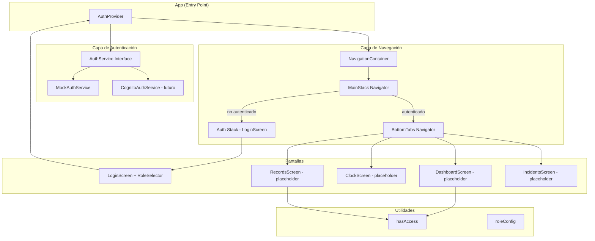
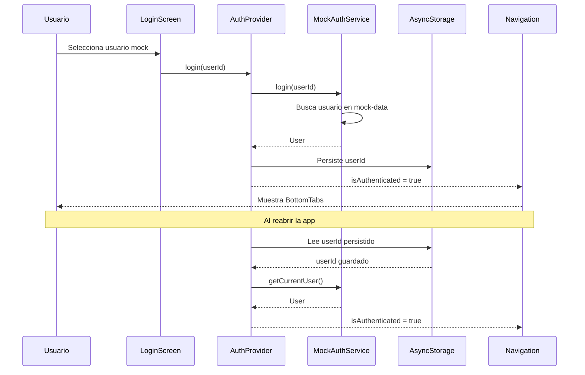

# Diseño — Setup, Navegación y Autenticación Móvil

## Visión General

Este documento describe el diseño técnico de la capa fundacional de la aplicación móvil React Native para gestión de asistencia en obra. Esta capa es la dependencia principal de los otros 4 integrantes del equipo y cubre:

- Inicialización del proyecto con TypeScript estricto
- Sistema de tipos compartidos (`UserRole`, `User`, `AuthService`)
- Proveedor de autenticación mock basado en `mock-data.json`
- Pantalla de login simulado con selector de rol
- Navegación con stack principal, pestañas inferiores y rutas protegidas por rol
- Pantallas placeholder para cada módulo funcional
- Utilidades de control de acceso por rol (`hasAccess`)
- Preparación para migración a Cognito real

La arquitectura sigue el principio de inversión de dependencias: el `AuthProvider` consume una interfaz `AuthService` que hoy se implementa con datos mock y mañana se sustituye por Cognito + `react-native-app-auth` sin tocar el resto de la app.

## Arquitectura

### Diagrama de Componentes



### Diagrama de Flujo de Autenticación



### Estructura de Archivos

```
src/
├── types/
│   └── index.ts              # UserRole, User, AuthService
├── auth/
│   ├── AuthContext.ts         # React Context + hook useAuth
│   ├── AuthProvider.tsx       # Provider que consume AuthService
│   └── MockAuthService.ts    # Implementación mock de AuthService
├── config/
│   └── cognito.ts             # Configuración placeholder de Cognito
├── navigation/
│   ├── MainStack.tsx          # Stack principal (auth vs app)
│   ├── BottomTabs.tsx         # Navegador de pestañas
│   └── linking.ts             # Configuración de deep links
├── screens/
│   ├── LoginScreen.tsx        # Pantalla de login con RoleSelector
│   ├── DashboardScreen.tsx    # Placeholder - Integrante 2
│   ├── ClockScreen.tsx        # Placeholder - Integrante 3
│   ├── RecordsScreen.tsx      # Placeholder - Integrante 4
│   └── IncidentsScreen.tsx    # Placeholder - Integrante 5
├── utils/
│   └── roles.ts               # hasAccess, roleConfig, permisos
└── App.tsx                    # Entry point: AuthProvider + NavigationContainer
```

## Componentes e Interfaces

### 1. Sistema de Tipos (`src/types/index.ts`)

```typescript
export type UserRole =
  | 'ADMIN'
  | 'JEFE_OBRA'
  | 'ENCARGADO'
  | 'TRABAJADOR'
  | 'PREVENCION'
  | 'SOLO_LECTURA';

export interface User {
  id: string;        // UUID
  email: string;
  firstName: string;
  lastName: string;
  role: UserRole;
}

export interface AuthService {
  login(userId: string): Promise<User>;
  logout(): Promise<void>;
  getCurrentUser(): Promise<User | null>;
}
```

**Decisión de diseño:** `AuthService` es una interfaz pura (no un contexto React) para que la implementación mock y la futura implementación Cognito sean intercambiables sin afectar al `AuthProvider`.

### 2. MockAuthService (`src/auth/MockAuthService.ts`)

Implementa `AuthService` cargando usuarios desde `mock-data.json`. Usa `AsyncStorage` para persistir el `userId` del usuario autenticado entre sesiones.

```typescript
// Pseudocódigo
class MockAuthService implements AuthService {
  private users: User[];  // Cargados desde mock-data.json

  async login(userId: string): Promise<User> {
    const user = this.users.find(u => u.id === userId);
    if (!user) throw new Error('Usuario no encontrado');
    await AsyncStorage.setItem('auth_user_id', userId);
    return user;
  }

  async logout(): Promise<void> {
    await AsyncStorage.removeItem('auth_user_id');
  }

  async getCurrentUser(): Promise<User | null> {
    const userId = await AsyncStorage.getItem('auth_user_id');
    if (!userId) return null;
    return this.users.find(u => u.id === userId) ?? null;
  }
}
```

### 3. AuthProvider (`src/auth/AuthProvider.tsx`)

Contexto React que envuelve la app y expone:

| Propiedad | Tipo | Descripción |
|-----------|------|-------------|
| `user` | `User \| null` | Usuario autenticado actual |
| `isAuthenticated` | `boolean` | `true` si hay usuario |
| `isLoading` | `boolean` | `true` mientras se restaura sesión |
| `login` | `(userId: string) => Promise<void>` | Autentica con un userId |
| `logout` | `() => Promise<void>` | Cierra sesión |
| `availableUsers` | `User[]` | Lista de usuarios mock disponibles |

**Ciclo de vida:**
1. Al montar, llama a `authService.getCurrentUser()` para restaurar sesión.
2. Mientras restaura, `isLoading = true` (la navegación puede mostrar splash).
3. `login()` delega en `authService.login()` y actualiza el estado.
4. `logout()` delega en `authService.logout()` y limpia el estado.

### 4. Utilidades de Rol (`src/utils/roles.ts`)

```typescript
export function hasAccess(userRole: UserRole, allowedRoles: UserRole[]): boolean {
  return allowedRoles.includes(userRole);
}

// Configuración de visibilidad por rol
export type DataScope = 'own' | 'team' | 'all';

export function getDataScope(role: UserRole): DataScope {
  switch (role) {
    case 'ADMIN':
    case 'JEFE_OBRA':
      return 'all';
    case 'ENCARGADO':
      return 'team';
    default:
      return 'own';
  }
}
```

### 5. Navegación

**MainStack** (`src/navigation/MainStack.tsx`):
- Si `!isAuthenticated` → muestra `LoginScreen`
- Si `isAuthenticated` → muestra `BottomTabs`
- Usa renderizado condicional (no `initialRouteName`) para que React Navigation maneje la transición automáticamente.

**BottomTabs** (`src/navigation/BottomTabs.tsx`):

| Pestaña | Screen | Icono | Visible para |
|---------|--------|-------|-------------|
| Inicio | DashboardScreen | home | Todos |
| Fichaje | ClockScreen | clock | Todos excepto SOLO_LECTURA |
| Registros | RecordsScreen | list | Todos |
| Incidencias | IncidentsScreen | alert | Todos excepto SOLO_LECTURA |

**Decisión de diseño:** Las pestañas se muestran/ocultan según el rol usando `hasAccess`. Cada pantalla internamente usa `getDataScope` para filtrar datos según el nivel de acceso del rol.

**Deep Linking** (`src/navigation/linking.ts`):

```typescript
const linking = {
  prefixes: ['construction://'],
  config: {
    screens: {
      Main: {
        screens: {
          Dashboard: 'callback',  // construction://callback → Dashboard
        },
      },
    },
  },
};
```

### 6. LoginScreen con RoleSelector

La pantalla muestra una `FlatList` con todos los usuarios de `mock-data.json`. Cada item muestra:
- Nombre completo (`firstName lastName`)
- Rol con badge de color diferenciado por rol
- Al pulsar, invoca `login(user.id)` del AuthProvider

**Decisión de diseño:** Se usa `FlatList` en lugar de `ScrollView` para manejar listas largas eficientemente, aunque con 4-6 usuarios mock no es crítico. Prepara la UI para cuando se añadan más usuarios de prueba.

### 7. Pantallas Placeholder

Cada placeholder sigue el mismo patrón:

```typescript
function PlaceholderScreen({ title, assignee }: { title: string; assignee: string }) {
  const { user } = useAuth();
  return (
    <View>
      <Text>{title}</Text>
      <Text>Usuario: {user?.firstName} {user?.lastName}</Text>
      <Text>Rol: {user?.role}</Text>
      <Text>Será implementada por: {assignee}</Text>
    </View>
  );
}
```

### 8. Configuración Cognito (`src/config/cognito.ts`)

```typescript
export const cognitoConfig = {
  issuer: 'https://cognito-idp.eu-west-1.amazonaws.com/<USER_POOL_ID>',
  clientId: '<APP_CLIENT_ID>',
  redirectUrl: 'construction://callback',
  scopes: ['openid', 'profile', 'email'],
  additionalParameters: {
    identity_provider: 'OneLogin',
  },
};
```

Valores placeholder que el Equipo 2 sustituirá con los reales.

## Modelos de Datos

### User (modelo principal de la app)

```typescript
interface User {
  id: string;        // UUID — mapea a mock-data.json "users[].id"
  email: string;     // mapea a "users[].email"
  firstName: string; // mapea a "users[].first_name"
  lastName: string;  // mapea a "users[].last_name"
  role: UserRole;    // mapea a "users[].role"
}
```

### Mapeo desde mock-data.json

Los campos de `mock-data.json` usan `snake_case` (estilo API), mientras que los tipos TypeScript usan `camelCase`. El `MockAuthService` realiza esta transformación al cargar los datos:

```typescript
// mock-data.json → User
{
  "id": "a1b2c3d4-...",          → id: "a1b2c3d4-..."
  "email": "admin@acciona.com",  → email: "admin@acciona.com"
  "first_name": "Carlos",        → firstName: "Carlos"
  "last_name": "Martínez",       → lastName: "Martínez"
  "role": "ADMIN"                → role: "ADMIN" as UserRole
}
```

### Estado de Autenticación (AuthContext)

```typescript
interface AuthState {
  user: User | null;
  isAuthenticated: boolean;
  isLoading: boolean;
  availableUsers: User[];
}
```

### Persistencia (AsyncStorage)

| Clave | Valor | Descripción |
|-------|-------|-------------|
| `auth_user_id` | `string (UUID)` | ID del usuario autenticado. Se elimina en logout. |

### Configuración de Roles

```typescript
// Mapeo de roles a niveles de acceso a datos
const ROLE_DATA_SCOPE: Record<UserRole, DataScope> = {
  ADMIN: 'all',
  JEFE_OBRA: 'all',
  ENCARGADO: 'team',
  TRABAJADOR: 'own',
  PREVENCION: 'all',   // lectura de todos los datos de seguridad
  SOLO_LECTURA: 'all',  // lectura de todos los datos, sin escritura
};
```

### Configuración de Pestañas por Rol

```typescript
// Pestañas visibles según rol
const TAB_VISIBILITY: Record<string, UserRole[]> = {
  Dashboard:   ['ADMIN', 'JEFE_OBRA', 'ENCARGADO', 'TRABAJADOR', 'PREVENCION', 'SOLO_LECTURA'],
  Clock:       ['ADMIN', 'JEFE_OBRA', 'ENCARGADO', 'TRABAJADOR', 'PREVENCION'],
  Records:     ['ADMIN', 'JEFE_OBRA', 'ENCARGADO', 'TRABAJADOR', 'PREVENCION', 'SOLO_LECTURA'],
  Incidents:   ['ADMIN', 'JEFE_OBRA', 'ENCARGADO', 'TRABAJADOR', 'PREVENCION'],
};
```


## Propiedades de Corrección

*Una propiedad es una característica o comportamiento que debe cumplirse en todas las ejecuciones válidas de un sistema — esencialmente, una declaración formal sobre lo que el sistema debe hacer. Las propiedades sirven como puente entre especificaciones legibles por humanos y garantías de corrección verificables por máquina.*

### Propiedad 1: Login establece el usuario correcto

*Para cualquier* userId válido presente en `mock-data.json`, invocar `login(userId)` debe resultar en que el usuario autenticado tenga el mismo `id`, `email`, `firstName`, `lastName` y `role` que el registro correspondiente en los datos mock.

**Valida: Requisitos 2.3**

### Propiedad 2: Login/logout es un viaje de ida y vuelta

*Para cualquier* usuario mock, si se invoca `login(userId)` seguido de `logout()`, el estado del AuthProvider debe volver a `user === null` e `isAuthenticated === false`, independientemente de qué usuario estaba autenticado.

**Valida: Requisitos 2.4**

### Propiedad 3: Consistencia de isAuthenticated

*Para cualquier* estado del AuthProvider, `isAuthenticated` debe ser `true` si y solo si `user` no es `null`. Nunca debe existir un estado donde `isAuthenticated` sea `true` con `user === null`, ni `isAuthenticated` sea `false` con `user !== null`.

**Valida: Requisitos 2.5**

### Propiedad 4: Persistencia de autenticación (round trip)

*Para cualquier* usuario mock, si se invoca `login(userId)` y luego se re-inicializa el AuthProvider (simulando recarga de la app), `getCurrentUser()` debe devolver el mismo usuario con los mismos campos.

**Valida: Requisitos 2.6**

### Propiedad 5: El estado de navegación sigue al estado de autenticación

*Para cualquier* estado de autenticación, si `isAuthenticated` es `false` la app debe mostrar únicamente la rama de autenticación (LoginScreen), y si `isAuthenticated` es `true` debe mostrar únicamente la rama de app autenticada (BottomTabs). No debe existir un estado intermedio.

**Valida: Requisitos 3.5, 4.2, 4.3**

### Propiedad 6: RoleSelector muestra todos los usuarios mock

*Para cualquier* conjunto de usuarios definidos en `mock-data.json`, el RoleSelector debe renderizar exactamente un elemento por cada usuario, y cada elemento debe contener el nombre completo y el rol del usuario correspondiente.

**Valida: Requisitos 3.1**

### Propiedad 7: Mapeo de rol a alcance de datos

*Para cualquier* `UserRole`, la función `getDataScope` debe devolver: `'all'` para ADMIN y JEFE_OBRA, `'team'` para ENCARGADO, y `'own'` para TRABAJADOR. PREVENCION y SOLO_LECTURA deben devolver `'all'` (lectura completa).

**Valida: Requisitos 4.5, 4.6, 4.7, 6.2, 6.3, 6.4, 6.5**

### Propiedad 8: Corrección de hasAccess

*Para cualquier* `UserRole` y *cualquier* lista de roles permitidos, `hasAccess(role, allowedRoles)` debe devolver `true` si y solo si `role` está contenido en `allowedRoles`.

**Valida: Requisitos 6.1**

### Propiedad 9: Redirección en acceso no autorizado

*Para cualquier* usuario autenticado y *cualquier* ruta protegida cuya lista de roles permitidos no incluya el rol del usuario, la app debe redirigir al usuario a la pantalla de Inicio (Dashboard) en lugar de mostrar la pantalla restringida.

**Valida: Requisitos 6.6**

### Propiedad 10: Propagación del contexto de autenticación a todas las pantallas

*Para cualquier* usuario autenticado y *cualquier* pantalla placeholder (Dashboard, Clock, Records, Incidents), la pantalla debe mostrar el rol del usuario autenticado actual, verificando que el contexto de autenticación se propaga correctamente a través del árbol de componentes.

**Valida: Requisitos 5.1, 5.5**

## Manejo de Errores

### Errores de Autenticación

| Escenario | Comportamiento |
|-----------|---------------|
| `login()` con userId inexistente | Lanza error `"Usuario no encontrado"`. La UI muestra un mensaje de error sin cambiar el estado. |
| `login()` con userId vacío o nulo | Lanza error de validación. No se modifica el estado. |
| Fallo al leer `AsyncStorage` en restauración | `getCurrentUser()` devuelve `null`. El usuario ve la pantalla de login. No se pierde funcionalidad. |
| Fallo al escribir en `AsyncStorage` en login | El login se completa en memoria pero no persiste. Al recargar, el usuario deberá autenticarse de nuevo. Se registra warning en consola. |
| Fallo al leer `mock-data.json` | La app muestra un error fatal con mensaje descriptivo. No se puede continuar sin datos de usuarios. |

### Errores de Navegación

| Escenario | Comportamiento |
|-----------|---------------|
| Acceso a ruta protegida sin autenticación | Redirección automática a LoginScreen (manejado por el renderizado condicional del MainStack). |
| Acceso a ruta sin permiso de rol | Redirección a Dashboard con mensaje informativo opcional. |
| Deep link `construction://callback` sin sesión | Se muestra LoginScreen. Tras autenticarse, se navega a Dashboard. |

### Principios de Manejo de Errores

1. **Fallos silenciosos en persistencia**: Si AsyncStorage falla, la app sigue funcionando en memoria. La persistencia es best-effort.
2. **Fallos fatales en datos**: Si no se pueden cargar los usuarios mock, la app no puede funcionar y debe mostrar un error claro.
3. **Sin estados inconsistentes**: Cualquier error durante login/logout debe dejar el AuthProvider en un estado válido (autenticado o no autenticado, nunca intermedio).

## Estrategia de Testing

### Framework y Herramientas

| Herramienta | Propósito |
|-------------|-----------|
| Jest | Framework de testing principal |
| React Native Testing Library | Testing de componentes React Native |
| fast-check | Property-based testing |
| @testing-library/react-native | Renderizado y queries de componentes |

### Enfoque Dual: Tests Unitarios + Tests de Propiedades

Se utilizan ambos tipos de tests de forma complementaria:

- **Tests unitarios**: Verifican ejemplos específicos, edge cases y condiciones de error
- **Tests de propiedades**: Verifican propiedades universales con entradas generadas aleatoriamente

### Tests Unitarios

Los tests unitarios cubren:

1. **Ejemplos específicos de configuración** (Requisitos 1.1-1.4, 4.4, 4.8, 7.1-7.3):
   - `tsconfig.json` tiene `strict: true`
   - `package.json` incluye las dependencias de navegación
   - El tipo `UserRole` contiene exactamente los 6 valores
   - La interfaz `User` tiene los campos requeridos
   - BottomTabs tiene las 4 pestañas correctas
   - Deep link configurado con `construction://callback`
   - `AuthService` define `login`, `logout`, `getCurrentUser`
   - Archivo `cognito.ts` existe con valores placeholder

2. **Edge cases y errores**:
   - Login con userId inexistente lanza error
   - Login con string vacío lanza error
   - Logout cuando no hay usuario autenticado no lanza error
   - Fallo de AsyncStorage no rompe la app

3. **Pantallas placeholder** (Requisitos 5.2-5.4):
   - ClockScreen muestra texto de Integrante 3
   - RecordsScreen muestra texto de Integrante 4
   - IncidentsScreen muestra texto de Integrante 5

### Tests de Propiedades (Property-Based Testing)

Se usa `fast-check` como librería de PBT. Cada test ejecuta mínimo 100 iteraciones.

Cada test de propiedad referencia su propiedad del documento de diseño con el formato:

```
// Feature: mobile-setup-navigation-auth, Property N: [título]
```

| Propiedad | Generadores | Verificación |
|-----------|-------------|-------------|
| P1: Login establece usuario correcto | Generar userId aleatorio del conjunto de mock users | Verificar que todos los campos del usuario coinciden |
| P2: Login/logout round trip | Generar userId aleatorio, login, logout | Verificar `user === null` e `isAuthenticated === false` |
| P3: Consistencia isAuthenticated | Generar secuencias aleatorias de login/logout | Verificar `isAuthenticated === (user !== null)` siempre |
| P4: Persistencia round trip | Generar userId aleatorio, login, re-init provider | Verificar que el usuario restaurado es idéntico |
| P5: Navegación sigue auth | Generar estado auth aleatorio (true/false) | Verificar que la rama visible corresponde al estado |
| P6: RoleSelector muestra todos | Generar subconjuntos aleatorios de usuarios mock | Verificar que todos aparecen renderizados |
| P7: Rol a alcance de datos | Generar UserRole aleatorio | Verificar que `getDataScope` devuelve el valor correcto |
| P8: hasAccess corrección | Generar UserRole y lista de roles aleatorios | Verificar `hasAccess(role, list) === list.includes(role)` |
| P9: Redirección no autorizado | Generar combinaciones de rol + ruta restringida | Verificar redirección a Dashboard |
| P10: Propagación de contexto | Generar usuario aleatorio + pantalla aleatoria | Verificar que el rol aparece en el render |

### Organización de Archivos de Test

```
src/
├── auth/
│   ├── MockAuthService.test.ts      # P1, P2, P3, P4 + unit tests
│   └── AuthProvider.test.tsx         # P3, P5 + unit tests
├── utils/
│   └── roles.test.ts                # P7, P8 + unit tests
├── screens/
│   └── LoginScreen.test.tsx          # P6 + unit tests
├── navigation/
│   ├── MainStack.test.tsx            # P5, P9 + unit tests
│   └── BottomTabs.test.tsx           # P10 + unit tests
```

### Configuración de fast-check

```typescript
import fc from 'fast-check';

// Generador de UserRole
const userRoleArb = fc.constantFrom(
  'ADMIN', 'JEFE_OBRA', 'ENCARGADO', 'TRABAJADOR', 'PREVENCION', 'SOLO_LECTURA'
);

// Generador de userId válido (del mock-data)
const mockUserIdArb = fc.constantFrom(
  'a1b2c3d4-0001-0001-0001-000000000001',
  'a1b2c3d4-0001-0001-0001-000000000002',
  'a1b2c3d4-0001-0001-0001-000000000003',
  'a1b2c3d4-0001-0001-0001-000000000004'
);

// Generador de lista de roles permitidos
const allowedRolesArb = fc.subarray([
  'ADMIN', 'JEFE_OBRA', 'ENCARGADO', 'TRABAJADOR', 'PREVENCION', 'SOLO_LECTURA'
] as const);
```
