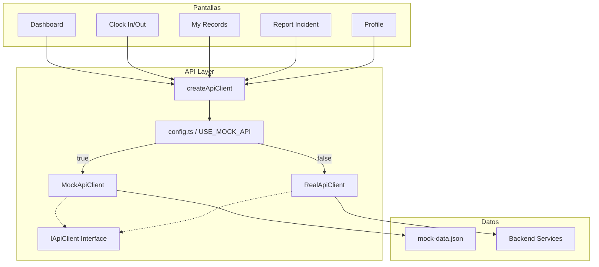

# Documento de Diseño — Types & Mock API Client

## Visión General

Este módulo establece la capa de abstracción de API para la app móvil React Native. Proporciona:

1. **Tipos TypeScript** derivados de `attendance-service.yaml` y `auth-service.yaml`
2. **Interfaz `IApiClient`** que define el contrato de todos los métodos de API
3. **`MockApiClient`** que devuelve datos realistas desde `mock-data.json` con reglas de negocio simuladas
4. **`RealApiClient`** que realiza llamadas HTTP reales con `fetch`
5. **Factory `createApiClient()`** que resuelve la implementación según el flag `USE_MOCK_API`

El mock mantiene estado en memoria (registros abiertos) para replicar reglas de negocio como el rechazo 409 si ya hay fichaje abierto, o 404 si no hay registro abierto al hacer clock-out.

## Arquitectura



### Decisiones de Diseño

| Decisión | Elección | Justificación |
|----------|----------|---------------|
| HTTP client (real) | `fetch` nativo | Disponible en React Native sin dependencias extra. Axios añade peso innecesario. |
| Generación de UUID (mock) | `uuid` package (v4) | Estándar, ligero, ya común en proyectos RN. |
| Retardo configurable | `setTimeout` con `MOCK_DELAY_MS` | Simple, sin dependencias. Default 300ms. |
| Estado mock | Map en memoria por `worker_id` | Permite simular reglas de negocio (409/404) sin persistencia. Se resetea al reiniciar. |
| Patrón de alternancia | Factory function `createApiClient()` | Más simple que un provider/context para este caso. Las pantallas importan la instancia directamente. |
| Estructura de archivos | Flat bajo `src/api/` | Mínima complejidad. Un archivo por responsabilidad. |

## Componentes e Interfaces

### Estructura de Archivos

```
src/
├── api/
│   ├── types.ts              # Todos los tipos/interfaces TypeScript
│   ├── client.interface.ts   # Interfaz IApiClient
│   ├── errors.ts             # Clase ApiError
│   ├── mock-client.ts        # MockApiClient
│   ├── real-client.ts        # RealApiClient
│   ├── config.ts             # USE_MOCK_API flag + URLs base
│   └── index.ts              # Factory createApiClient() + re-exports
```

### Interfaz `IApiClient`

```typescript
interface IApiClient {
  clockIn(request: ClockInRequest): Promise<AttendanceRecord>;
  clockOut(request: ClockOutRequest): Promise<AttendanceRecord>;
  getRecords(params: RecordsQueryParams): Promise<PaginatedAttendanceRecords>;
  getTodayRecords(params?: TodayQueryParams): Promise<TodaySummary>;
  createIncident(request: CreateIncidentRequest): Promise<AttendanceIncident>;
  getMe(): Promise<User>;
}
```

### `MockApiClient`

- Implementa `IApiClient`
- Mantiene un `Map<string, AttendanceRecord>` de registros abiertos por `worker_id`
- Carga datos de `mock-data.json` para workers y usuarios
- Genera UUIDs con `uuid.v4()` para nuevos registros
- Aplica retardo configurable via `MOCK_DELAY_MS`
- Valida reglas de negocio:
  - `clockIn`: rechaza con 409 si ya hay registro abierto para ese worker
  - `clockOut`: rechaza con 404 si no hay registro abierto
  - `clockIn`/`createIncident`: rechaza con 400 si faltan campos requeridos

### `RealApiClient`

- Implementa `IApiClient`
- Usa `fetch` nativo de React Native
- Inyecta token JWT en header `Authorization: Bearer <token>`
- URLs base configurables: `ATTENDANCE_API_URL` y `AUTH_API_URL`
- Parsea errores del backend a `ApiError`

### `ApiError`

```typescript
class ApiError extends Error {
  code: string;
  statusCode: number;
  details?: Array<{ field: string; message: string }>;
}
```

### Factory

```typescript
// config.ts
export const USE_MOCK_API = true; // cambiar a false cuando backend esté listo

// index.ts
export function createApiClient(): IApiClient {
  if (USE_MOCK_API) {
    return new MockApiClient();
  }
  return new RealApiClient();
}
```


## Modelos de Datos

### Tipos del Attendance Service

```typescript
// --- Union Types ---
type ClockMethod = 'GPS' | 'QR' | 'NFC' | 'MANUAL';
type RecordStatus = 'OPEN' | 'CLOSED' | 'INCIDENT';
type IncidentType = 'OLVIDO_ENTRADA' | 'OLVIDO_SALIDA' | 'CORRECCION_HORA' | 'FICHAJE_DUPLICADO' | 'OTRO';
type IncidentStatus = 'PENDING' | 'RESOLVED' | 'REJECTED';

// --- Interfaces ---
interface GeoLocation {
  latitude: number;
  longitude: number;
}

interface ClockInRequest {
  worker_id: string;
  method: ClockMethod;
  latitude?: number;
  longitude?: number;
  notes?: string;
}

interface ClockOutRequest {
  worker_id: string;
  method: ClockMethod;
  latitude?: number;
  longitude?: number;
  notes?: string;
}

interface AttendanceRecord {
  id: string;
  worker_id: string;
  worker_name: string;
  date: string;
  clock_in: string;
  clock_out: string | null;
  clock_in_method: ClockMethod;
  clock_out_method: ClockMethod | null;
  clock_in_location: GeoLocation | null;
  clock_out_location: GeoLocation | null;
  total_hours: number | null;
  status: RecordStatus;
  modified_by: string | null;
  modification_reason: string | null;
  created_at: string;
}

interface UpdateRecordRequest {
  clock_in?: string;
  clock_out?: string;
  reason: string;
}

interface TodaySummary {
  date: string;
  total_workers_present: number;
  total_workers_absent: number;
  records: AttendanceRecord[];
}

interface AttendanceIncident {
  id: string;
  worker_id: string;
  worker_name: string;
  type: IncidentType;
  description: string;
  affected_date: string;
  proposed_clock_in: string | null;
  proposed_clock_out: string | null;
  status: IncidentStatus;
  resolution_notes: string | null;
  resolved_by: string | null;
  created_at: string;
  resolved_at: string | null;
}

interface CreateIncidentRequest {
  worker_id: string;
  type: IncidentType;
  description: string;
  affected_date: string;
  proposed_clock_in?: string;
  proposed_clock_out?: string;
}

interface ResolveIncidentRequest {
  resolution: 'APPROVE' | 'REJECT';
  notes?: string;
}

interface WorkerHoursSummary {
  worker_id: string;
  worker_name: string;
  period_from: string;
  period_to: string;
  total_hours: number;
  regular_hours: number;
  overtime_hours: number;
  days_worked: number;
  days_absent: number;
  pending_incidents: number;
  daily_breakdown: Array<{
    date: string;
    hours: number;
    is_overtime: boolean;
  }>;
}

interface TeamHoursSummary {
  team_id: string;
  team_name: string;
  period_from: string;
  period_to: string;
  total_hours: number;
  total_overtime_hours: number;
  average_hours_per_worker: number;
  workers_summary: WorkerHoursSummary[];
}

// --- Paginación ---
interface PaginatedAttendanceRecords {
  content: AttendanceRecord[];
  page: number;
  size: number;
  total_elements: number;
  total_pages: number;
}

interface PaginatedIncidents {
  content: AttendanceIncident[];
  page: number;
  size: number;
  total_elements: number;
  total_pages: number;
}

// --- Query Params ---
interface RecordsQueryParams {
  worker_id?: string;
  team_id?: string;
  company_id?: string;
  date_from: string;
  date_to: string;
  status?: RecordStatus;
  page?: number;
  size?: number;
}

interface TodayQueryParams {
  team_id?: string;
  company_id?: string;
}
```

### Tipos del Auth Service

```typescript
type RoleName = 'ADMIN' | 'JEFE_OBRA' | 'ENCARGADO' | 'TRABAJADOR' | 'PREVENCION' | 'SOLO_LECTURA';

interface Role {
  id: string;
  name: RoleName;
  description: string;
  permissions: string[];
}

interface User {
  id: string;
  external_id: string;
  email: string;
  first_name: string;
  last_name: string;
  role: Role;
  active: boolean;
  last_login_at: string | null;
  created_at: string;
  updated_at: string;
}
```

### Tipo de Error

```typescript
interface ApiErrorDetail {
  field: string;
  message: string;
}

class ApiError extends Error {
  constructor(
    public code: string,
    message: string,
    public statusCode: number,
    public details?: ApiErrorDetail[],
  ) {
    super(message);
    this.name = 'ApiError';
  }
}
```

### Estado Interno del Mock

El `MockApiClient` mantiene estado en memoria para simular reglas de negocio:

```typescript
// Mapa de registros abiertos: worker_id -> AttendanceRecord
private openRecords: Map<string, AttendanceRecord> = new Map();
```

- Al hacer `clockIn`, se añade una entrada al mapa.
- Al hacer `clockOut`, se elimina la entrada del mapa y se retorna el registro cerrado.
- Esto permite validar las reglas 409 (ya fichado) y 404 (sin fichaje abierto).

